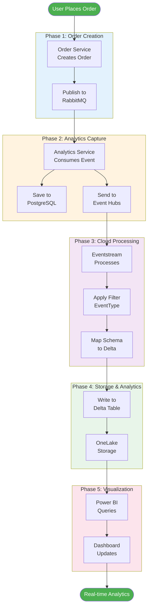

# Analytics Service - Architecture Diagrams

## Overview
This document provides detailed architectural diagrams for the Analytics Service and its integration with Microsoft Fabric. These diagrams illustrate the data flow, component interactions, and system architecture from multiple perspectives.

---

## 1. High-Level System Architecture

This diagram shows the complete analytics pipeline from local development through Azure cloud services to Microsoft Fabric and Power BI.


### Key Components

**Local Development Environment:**
- **Microservices**: OrderService, PaymentService, ProductService, InventoryService generate business events
- **RabbitMQ**: Message broker that enables asynchronous, decoupled communication between services
- **AnalyticsService**: Consumes events from RabbitMQ and implements dual-write pattern
- **PostgreSQL**: Local relational database for development and testing analytics queries

**Azure Cloud:**
- **Event Hubs**: Highly scalable event streaming platform that acts as the bridge between on-premises/local services and cloud analytics
- **analytics-events Hub**: Specific Event Hub configured to receive all analytics events

**Microsoft Fabric:**
- **Eventstream**: Real-time stream processing service that ingests events from Event Hubs
- **ProductOrderingLakehouse**: OneLake-based data lakehouse using Delta Lake format for ACID transactions
- **SQL Analytics Endpoint**: T-SQL interface for querying lakehouse data
- **Power BI**: Business intelligence platform for creating interactive dashboards and reports

### Data Flow Pattern

The architecture implements a **dual-write pattern** where the AnalyticsService simultaneously:
1. Writes to PostgreSQL for local development and testing
2. Streams to Event Hubs for cloud-based analytics and long-term storage

This approach provides:
- **Local Development**: Fast feedback loop without cloud dependencies
- **Cloud Analytics**: Centralized data warehouse for production insights
- **Resilience**: Graceful degradation if Event Hubs is unavailable
- **Flexibility**: Can evolve local and cloud storage independently

---

## 2. Event Processing Sequence Flow

This sequence diagram illustrates the complete lifecycle of an analytics event from user action to dashboard visualization.


### Step-by-Step Breakdown

1. **User Interaction**: User places an order through the web UI or API
2. **Event Publication**: OrderService publishes an `OrderCreatedEvent` to RabbitMQ
3. **Event Consumption**: AnalyticsService consumes the event via MassTransit
4. **Dual Write** (Parallel):
   - **PostgreSQL Path**: Event data saved to local PostgreSQL for immediate querying
   - **Event Hubs Path**: Event serialized to JSON and sent to Azure Event Hubs
5. **Cloud Streaming**: Event Hubs streams the event to Fabric Eventstream
6. **Event Filtering**: Eventstream applies filter based on `EventType` field
7. **Schema Mapping**: Event JSON mapped to Delta table schema
8. **Delta Write**: Data written to appropriate Delta table in Lakehouse
9. **Power BI Query**: Dashboard queries lakehouse for latest data
10. **Visualization**: Updated metrics displayed to user

### Parallel Processing Benefits

The parallel dual-write pattern ensures:
- **No Blocking**: PostgreSQL write completes independently of Event Hubs
- **Fast Local Queries**: Development teams can query PostgreSQL immediately
- **Cloud Reliability**: Event Hubs handles temporary failures with retry logic
- **Data Consistency**: Both stores eventually contain the same data

### Error Handling

If Event Hubs fails:
- PostgreSQL write still succeeds
- Error logged as warning (not exception)
- Application continues normally
- Event Hubs automatically retries on next event

---

## 3. Event Routing and Table Mapping

This diagram shows how different event types are filtered and routed to their respective Delta tables in the Lakehouse.


### Event Type Filtering

The Eventstream processes each incoming event through multiple filter conditions simultaneously:

**OrderEvent Filter:**
- **Condition**: `EventType = "OrderEvent"`
- **Fields Extracted**: OrderId, CustomerId, TotalAmount, Status, ItemCount, EventTimestamp
- **Destination**: `OrderEvents` Delta table
- **Use Cases**: Order volume analysis, order status tracking, revenue calculations

**PaymentEvent Filter:**
- **Condition**: `EventType = "PaymentEvent"`
- **Fields Extracted**: PaymentId, OrderId, Amount, Status, PaymentMethod, EventTimestamp
- **Destination**: `PaymentEvents` Delta table
- **Use Cases**: Payment success rates, revenue reconciliation, payment method preferences

**ProductEvent Filter:**
- **Condition**: `EventType = "ProductEvent"`
- **Fields Extracted**: ProductId, Name, Category, Price, EventType (Created/Updated), EventTimestamp
- **Destination**: `ProductEvents` Delta table
- **Use Cases**: Product catalog changes, pricing history, product lifecycle tracking

**InventoryEvent Filter:**
- **Condition**: `EventType = "InventoryEvent"`
- **Fields Extracted**: ProductId, OrderId, QuantityChange, QuantityAfter, EventType (Reserved/Released), EventTimestamp
- **Destination**: `InventoryEvents` Delta table
- **Use Cases**: Inventory turnover analysis, stock level trends, reservation patterns

### Benefits of Separate Tables

**Query Performance:**
- Each table optimized for specific query patterns
- Smaller tables mean faster scans
- Targeted indexes on relevant columns

**Schema Evolution:**
- Each event type can evolve independently
- No need for sparse columns or complex unions
- Type-safe queries with predictable schemas

**Access Control:**
- Fine-grained permissions per table
- Different teams can own different event types
- Easier compliance and auditing

**Cost Optimization:**
- Only query tables needed for specific analytics
- Reduce compute costs by scanning less data
- Better partition pruning per event type

---

## 4. AnalyticsService Clean Architecture

This diagram illustrates the internal structure of the AnalyticsService following Clean Architecture principles.


### Layer Responsibilities

**Domain Layer (Core):**
- **Pure entities**: No dependencies on external frameworks
- **Business rules**: Validation logic embedded in entities
- **Value objects**: Immutable data structures
- **No external dependencies**: Can be tested in isolation
- **Examples**: OrderEvent, PaymentEvent with properties and validation

**Application Layer (Use Cases):**
- **MediatR Queries**: Define what the system can do
- **Interfaces**: Abstract external dependencies (IEventHubPublisher)
- **DTOs**: Data transfer objects for queries and responses
- **Orchestration**: Coordinate domain entities and infrastructure
- **Examples**: GetAnalyticsSummary query, GetDailyOrders query

**Infrastructure Layer (Plumbing):**
- **MassTransit Consumers**: Handle message consumption from RabbitMQ
- **Query Handlers**: Implement Application layer queries using EF Core
- **EventHubPublisher**: Concrete implementation of IEventHubPublisher
- **DbContext**: Entity Framework Core database context
- **External SDKs**: Azure Event Hubs SDK, Npgsql driver

**WebAPI Layer (Entry Point):**
- **Minimal APIs**: HTTP endpoints using .NET 10 Minimal API pattern
- **Service Registration**: Dependency injection configuration
- **Middleware**: Logging, error handling, health checks
- **API Documentation**: OpenAPI/Swagger integration

### Dependency Flow

Dependencies flow **inward** toward the Domain:
- WebAPI → Application → Domain
- Infrastructure → Application → Domain
- No layer depends on outer layers
- Application defines interfaces, Infrastructure implements them

### Benefits of This Architecture

**Testability:**
- Domain can be unit tested without any infrastructure
- Application queries tested with in-memory implementations
- Infrastructure tested with integration tests

**Maintainability:**
- Clear separation of concerns
- Easy to locate and modify code
- Changes in one layer don't ripple through others

**Flexibility:**
- Can swap PostgreSQL for another database
- Can replace Event Hubs with Kafka or other systems
- Framework-agnostic business logic

**Scalability:**
- Each layer can be optimized independently
- Clear boundaries for microservice decomposition
- Easy to add new queries or consumers

---

## 5. End-to-End Data Flow Journey

This diagram visualizes the complete journey of data from user interaction to Power BI dashboard across five distinct phases.



### Phase-by-Phase Analysis

**Phase 1: Order Creation (Local/Development)**
- **Duration**: < 100ms
- **Components**: OrderService, RabbitMQ
- **Action**: User submits order through UI, OrderService validates and creates order, publishes event to RabbitMQ
- **Output**: OrderCreatedEvent in RabbitMQ queue

**Phase 2: Analytics Capture (Dual Path)**
- **Duration**: < 200ms (parallel)
- **Components**: AnalyticsService, PostgreSQL, Event Hubs
- **Action**: 
  - MassTransit consumer receives event
  - Simultaneously saves to PostgreSQL (fast, local)
  - Sends to Event Hubs (network call to Azure)
- **Output**: Data in PostgreSQL + Event in Event Hubs

**Phase 3: Cloud Processing (Azure/Fabric)**
- **Duration**: < 500ms
- **Components**: Fabric Eventstream
- **Action**:
  - Eventstream ingests from Event Hubs
  - Applies EventType filter to route to correct table
  - Maps JSON fields to Delta table schema
- **Output**: Transformed event ready for storage

**Phase 4: Storage & Analytics (Fabric Lakehouse)**
- **Duration**: < 1 second
- **Components**: OneLake, Delta tables
- **Action**:
  - Writes to Delta table with ACID guarantees
  - Updates table statistics and metadata
  - Optimizes file layout for query performance
- **Output**: Queryable data in lakehouse

**Phase 5: Visualization (Power BI)**
- **Duration**: 5-15 seconds (refresh interval)
- **Components**: Power BI Service/Desktop
- **Action**:
  - Power BI queries SQL analytics endpoint
  - Retrieves latest data for dashboard
  - Renders updated visualizations
- **Output**: Real-time dashboard showing latest metrics

### Total Latency

**End-to-End**: Typically 5-20 seconds from order placement to dashboard update

**Optimization Opportunities:**
- Use Power BI DirectQuery for < 5 second latency
- Configure Eventstream for batch writes (higher throughput, slightly higher latency)
- Optimize Delta table partitioning for query performance

---

## 6. Eventstream Configuration Structure

This diagram shows the actual Eventstream configuration with source, filters, and destinations as they appear in Microsoft Fabric.


### Configuration Details

**Source Configuration:**
- **Type**: Azure Event Hubs
- **Namespace**: evhns-product-ordering.servicebus.windows.net
- **Event Hub**: analytics-events
- **Consumer Group**: $Default (or dedicated: fabric-consumer)
- **Authentication**: Shared Access Key
- **Data Format**: JSON
- **Compression**: None

**Event Processing (Transformation Layer):**

Each filter represents a separate data flow in Eventstream:

1. **OrderEvent Filter** (Green):
   - Expression: `EventType = "OrderEvent"`
   - Processes: Order creation events
   - Fields: OrderId, CustomerId, TotalAmount, Status, ItemCount

2. **PaymentEvent Filter** (Blue):
   - Expression: `EventType = "PaymentEvent"`
   - Processes: Payment processing events
   - Fields: PaymentId, OrderId, Amount, Status, PaymentMethod

3. **ProductEvent Filter** (Orange):
   - Expression: `EventType = "ProductEvent"`
   - Processes: Product lifecycle events
   - Fields: ProductId, Name, Category, Price

4. **InventoryEvent Filter** (Purple):
   - Expression: `EventType = "InventoryEvent"`
   - Processes: Inventory changes
   - Fields: ProductId, OrderId, QuantityChange, QuantityAfter

**Lakehouse Destinations:**

Each destination writes to a dedicated Delta table:
- **Write Mode**: Append (insert-only)
- **Format**: Delta Lake
- **Storage**: OneLake (Azure Data Lake Storage Gen2)
- **Partitioning**: By EventTimestamp (optional, for large volumes)
- **Indexing**: Auto-indexed on key columns

### Monitoring This Configuration

In Fabric Eventstream Monitor tab, you can view:
- **Source Events/sec**: Rate of events from Event Hubs
- **Filtered Events**: Events matching each filter
- **Destination Writes**: Successful writes to each table
- **Errors**: Failed transformations or writes
- **Latency**: End-to-end processing time

---

## 7. Alternative Simpler Architecture (Single Table)

For teams wanting a simpler initial setup, this diagram shows a single-table approach.


### Single Table Schema

```sql
CREATE TABLE AllAnalyticsEvents (
    Id UNIQUEIDENTIFIER PRIMARY KEY,
    EventType VARCHAR(50) NOT NULL,
    EventData NVARCHAR(MAX),  -- Full JSON
    Timestamp DATETIME2 NOT NULL,
    PartitionKey VARCHAR(100)
)
```

### Querying Single Table

```sql
-- Get orders
SELECT 
    EventType,
    JSON_VALUE(EventData, '$.Data.OrderId') AS OrderId,
    JSON_VALUE(EventData, '$.Data.TotalAmount') AS TotalAmount,
    Timestamp
FROM AllAnalyticsEvents
WHERE EventType = 'OrderEvent'
ORDER BY Timestamp DESC;

-- Get payments
SELECT 
    EventType,
    JSON_VALUE(EventData, '$.Data.PaymentId') AS PaymentId,
    JSON_VALUE(EventData, '$.Data.Status') AS Status,
    Timestamp
FROM AllAnalyticsEvents
WHERE EventType = 'PaymentEvent'
ORDER BY Timestamp DESC;
```

### Pros and Cons

**Advantages:**
- ✅ Simpler Eventstream setup (1 destination vs 4)
- ✅ Faster initial implementation
- ✅ No need to maintain multiple schemas
- ✅ Flexible for ad-hoc queries
- ✅ Can evolve to separate tables later

**Disadvantages:**
- ❌ Slower queries (must scan entire table)
- ❌ JSON parsing overhead
- ❌ No type safety in queries
- ❌ Harder to optimize with indexes
- ❌ All-or-nothing access control

### When to Use Single Table

**Good for:**
- Proof of concept / MVP
- Low event volumes (< 1M events/month)
- Exploratory analytics
- Quick prototyping

**Not recommended for:**
- High query performance requirements
- Large event volumes (> 10M events/month)
- Production workloads with SLAs
- Teams needing separate table ownership

### Migration Path

Start with single table, then:
1. Create separate tables using Spark notebooks
2. Migrate historical data with SQL
3. Update Eventstream to use filters
4. Deprecate single table

---

## 8. Power BI Dashboard Architecture

This diagram shows how Power BI connects to the Lakehouse and builds real-time dashboards.


### Power BI Integration Options

**DirectQuery Mode:**
- Queries Lakehouse in real-time
- Always shows latest data
- No data import required
- Higher latency per query
- Best for: Real-time dashboards

**Import Mode:**
- Copies data into Power BI
- Faster query performance
- Scheduled refresh (e.g., every 15 minutes)
- Lower latency
- Best for: Historical analysis

### Sample DAX Measures

```dax
Total Orders = COUNT(OrderEvents[OrderId])

Total Revenue = 
    CALCULATE(
        SUM(PaymentEvents[Amount]),
        PaymentEvents[Status] = "succeeded"
    )

Avg Order Value = 
    DIVIDE([Total Revenue], [Total Orders], 0)

Payment Success Rate = 
    DIVIDE(
        CALCULATE(COUNT(PaymentEvents[PaymentId]), PaymentEvents[Status] = "succeeded"),
        COUNT(PaymentEvents[PaymentId])
    )

Top Products = 
    TOPN(
        10,
        SUMMARIZE(
            InventoryEvents,
            ProductEvents[Name],
            "Quantity Sold", SUM(InventoryEvents[QuantityChange])
        ),
        [Quantity Sold],
        DESC
    )
```

---

## Summary

These diagrams provide multiple perspectives on the Analytics Service architecture:

1. **System Architecture**: Overall integration with Azure and Fabric
2. **Event Processing**: Detailed sequence of operations
3. **Event Routing**: How events are filtered and stored
4. **Clean Architecture**: Internal service structure
5. **Data Flow**: End-to-end journey
6. **Eventstream Config**: Actual Fabric configuration
7. **Single Table Alternative**: Simpler approach
8. **Power BI Integration**: Dashboard architecture

Each diagram serves a specific purpose:
- **Technical teams**: Use Clean Architecture and Event Processing diagrams
- **Business stakeholders**: Focus on Data Flow and Power BI diagrams
- **Operations teams**: Reference System Architecture and Eventstream Config
- **New team members**: Start with System Architecture and progress through others

For implementation details, see:
- [Fabric Eventstream Setup Guide](./Fabric-Eventstream-Setup.md)
- [Analytics Event Hub Integration](./Analytics-EventHub-Integration.md)
