---
tags:
  - architecture
  - diagrams
  - system-design
  - microservices
  - mermaid
  - event-driven
  - aspire
---

# Product Ordering System - Architecture Diagrams

This document contains comprehensive architecture diagrams showing the system's structure, data flow, and event-driven communication patterns.

## Table of Contents
1. [High-Level System Architecture](#high-level-system-architecture)
2. [Service Communication Flow](#service-communication-flow)
3. [Order Processing Flow](#order-processing-flow)
4. [Event-Driven Architecture](#event-driven-architecture)
5. [Database Architecture](#database-architecture)

---

## High-Level System Architecture

### System Overview

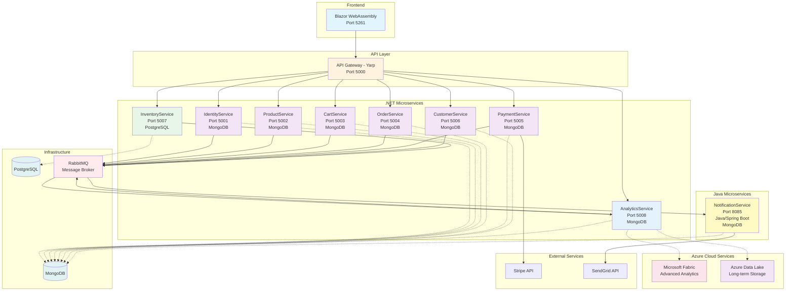

### Technology Stack

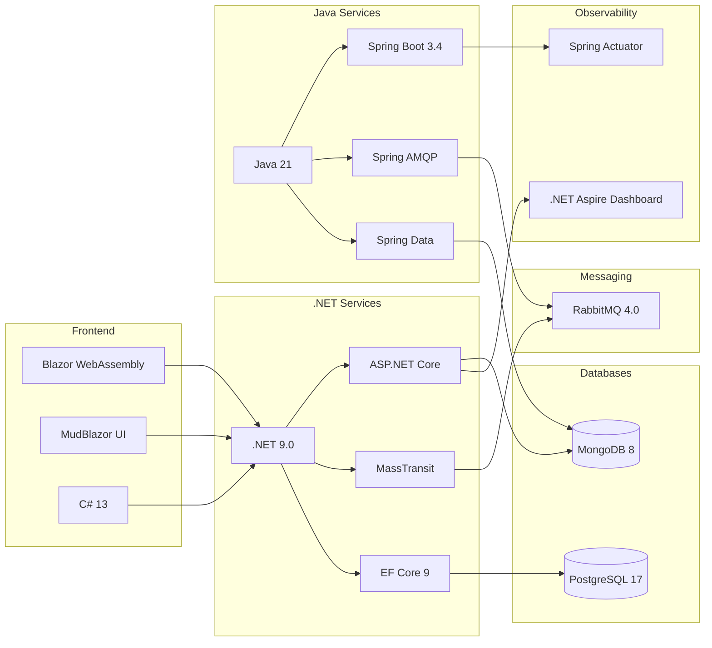

---

## Service Communication Flow

### Customer Shopping Journey

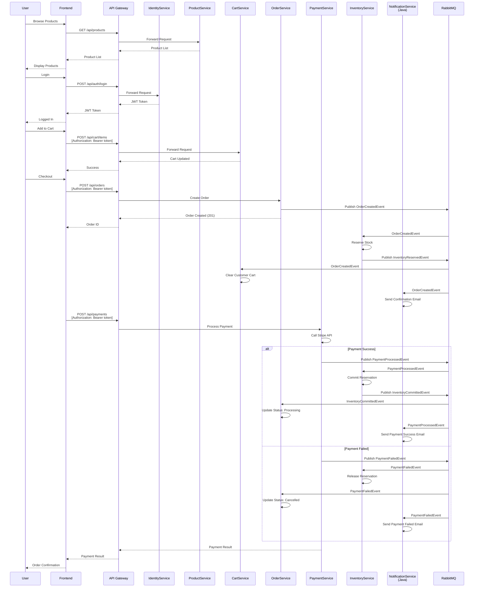

---

## Order Processing Flow

### Complete Order Lifecycle

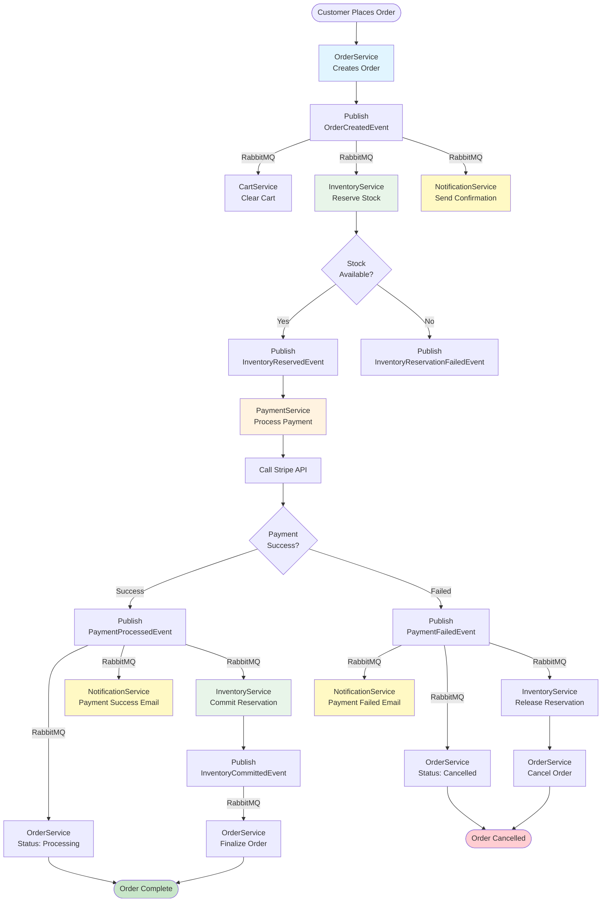

### Saga Pattern - Compensation Flow

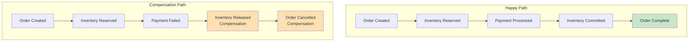

---

## Event-Driven Architecture

### Event Flow Map

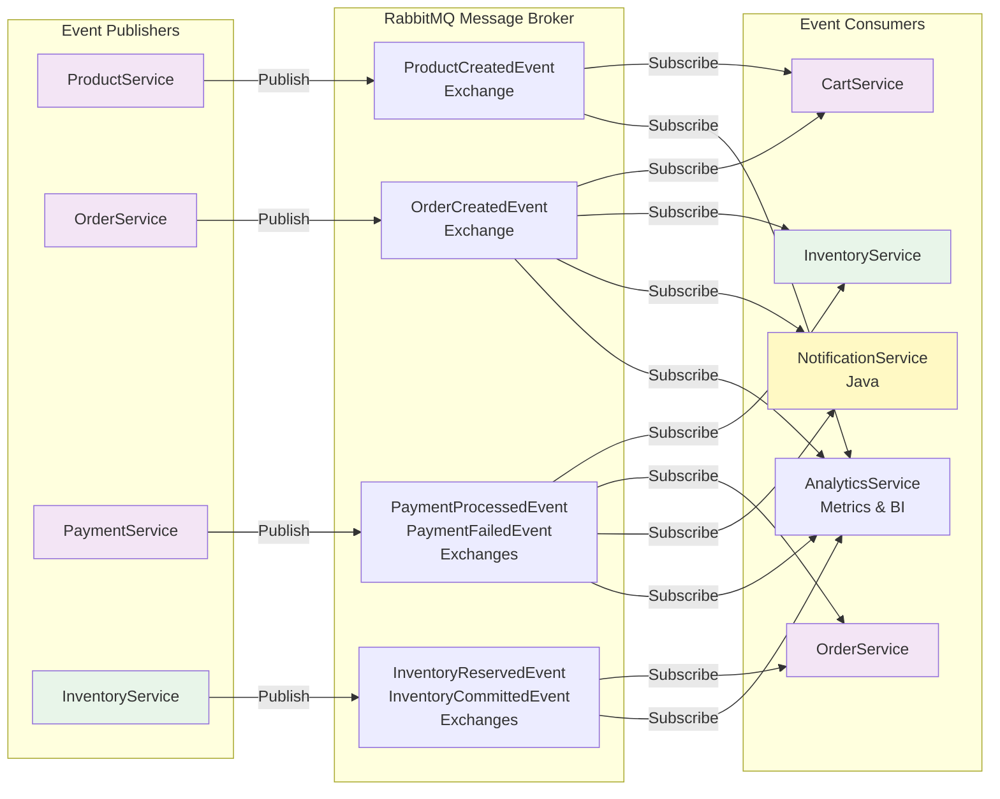

### Event Types and Consumers

```mermaid
flowchart TD
    subgraph "Product Events"
        PE1[ProductCreatedEvent]
        PE2[ProductUpdatedEvent]
        PE3[ProductDeletedEvent]
    end
    
    subgraph "Order Events"
        OE1[OrderCreatedEvent]
        OE2[OrderCancelledEvent]
    end
    
    subgraph "Payment Events"
        PAE1[PaymentProcessedEvent]
        PAE2[PaymentFailedEvent]
    end
    
    subgraph "Inventory Events"
        IE1[InventoryReservedEvent]
        IE2[InventoryCommittedEvent]
        IE3[InventoryReservationFailedEvent]
    end
    
    PE1 & PE2 & PE3 -.->|Cache Product| CART[CartService]
    OE1 -.->|Clear Cart| CART
    OE1 -.->|Reserve Stock| INV[InventoryService]
    OE1 -.->|Send Email| NOT[NotificationService]
    
    PAE1 -.->|Commit Stock| INV
    PAE1 -.->|Update Status| ORD[OrderService]
    PAE1 -.->|Send Email| NOT
    
    PAE2 -.->|Release Stock| INV
    PAE2 -.->|Cancel Order| ORD
    PAE2 -.->|Send Email| NOT
    
    IE1 & IE2 & IE3 -.->|Update Status| ORD
    
    style CART fill:#f3e5f5
    style INV fill:#e8f5e9
    style NOT fill:#fff9c4
    style ORD fill:#f3e5f5
```

---

## Database Architecture

### Database-Per-Service Pattern

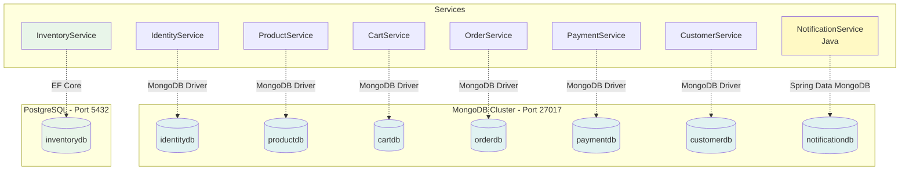

### Data Models by Service

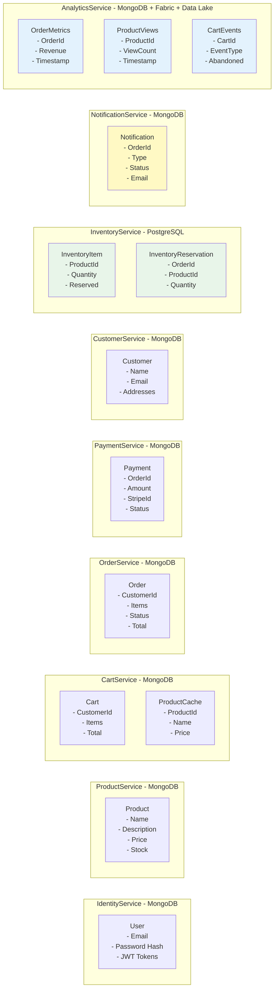

---

## Deployment Architecture

### Container Organization

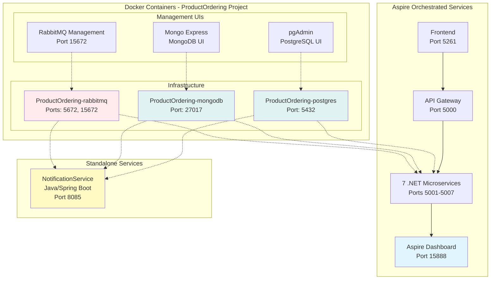

### Port Allocation

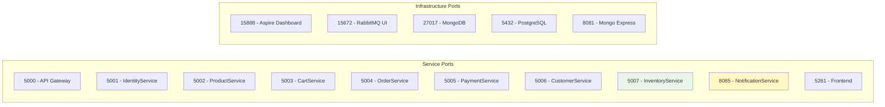

---

## Security Architecture

### Authentication & Authorization Flow

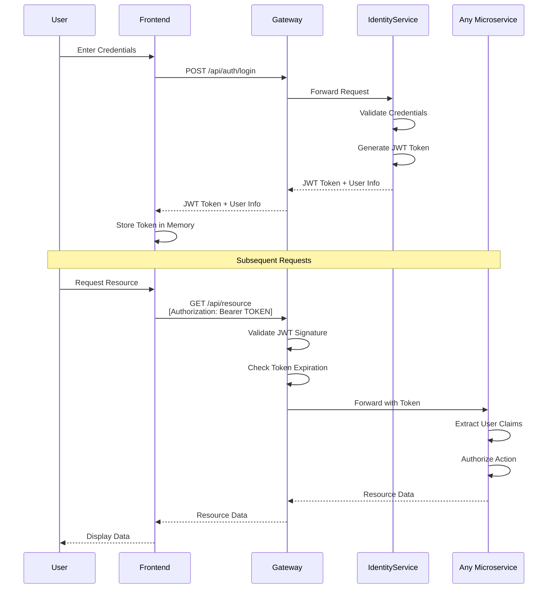

### JWT Token Structure

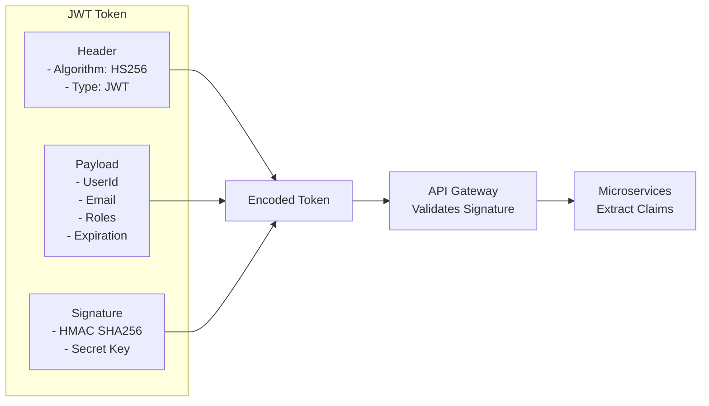

---

## Observability & Monitoring

### Logging and Tracing

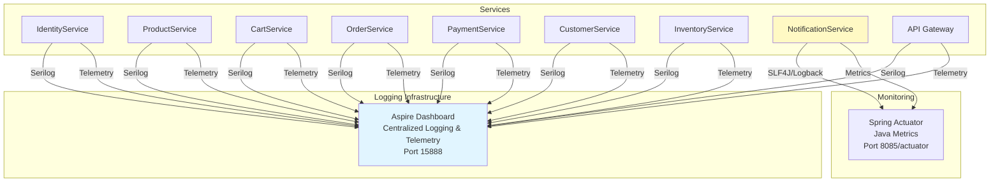

### Correlation Tracking

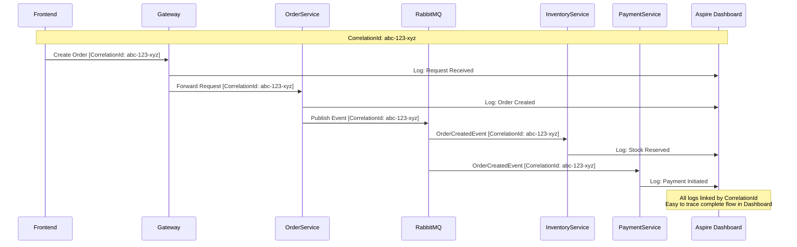

---

## Analytics Architecture

### Analytics Service Data Flow

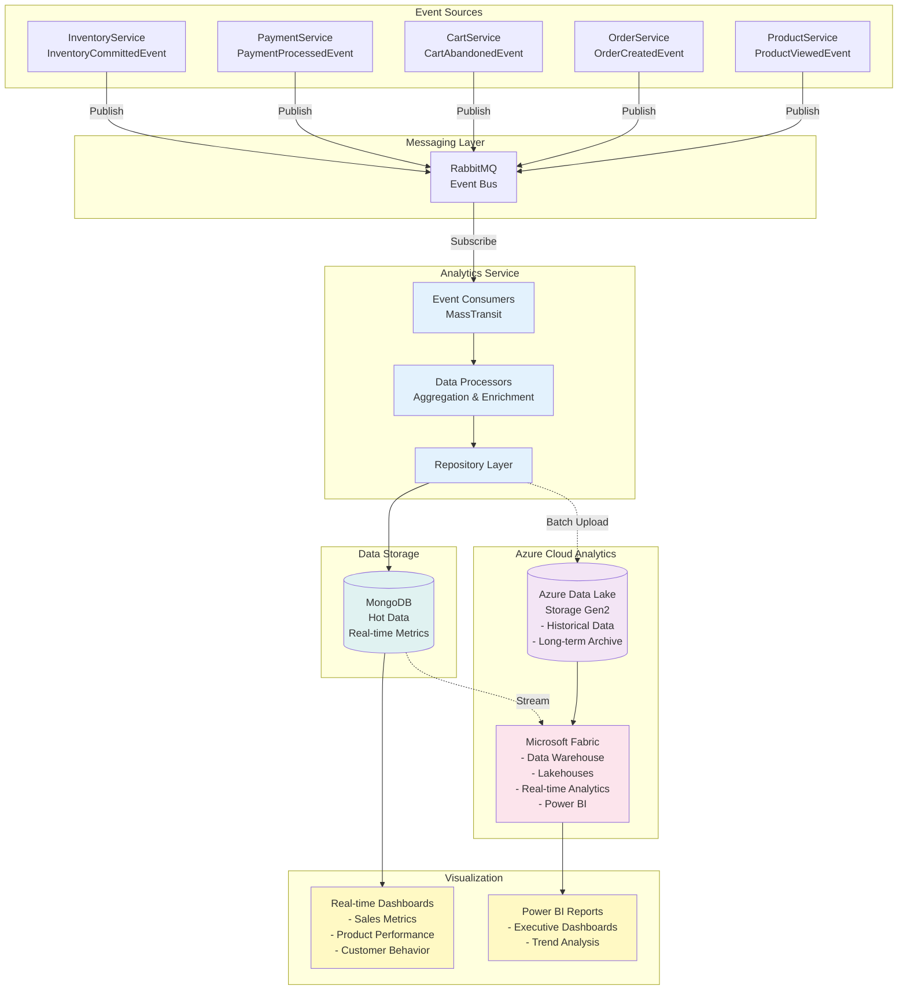

### Analytics Event Processing

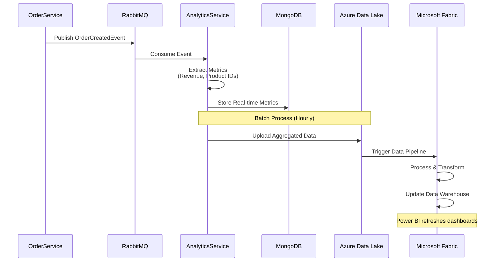

### Analytics Data Models

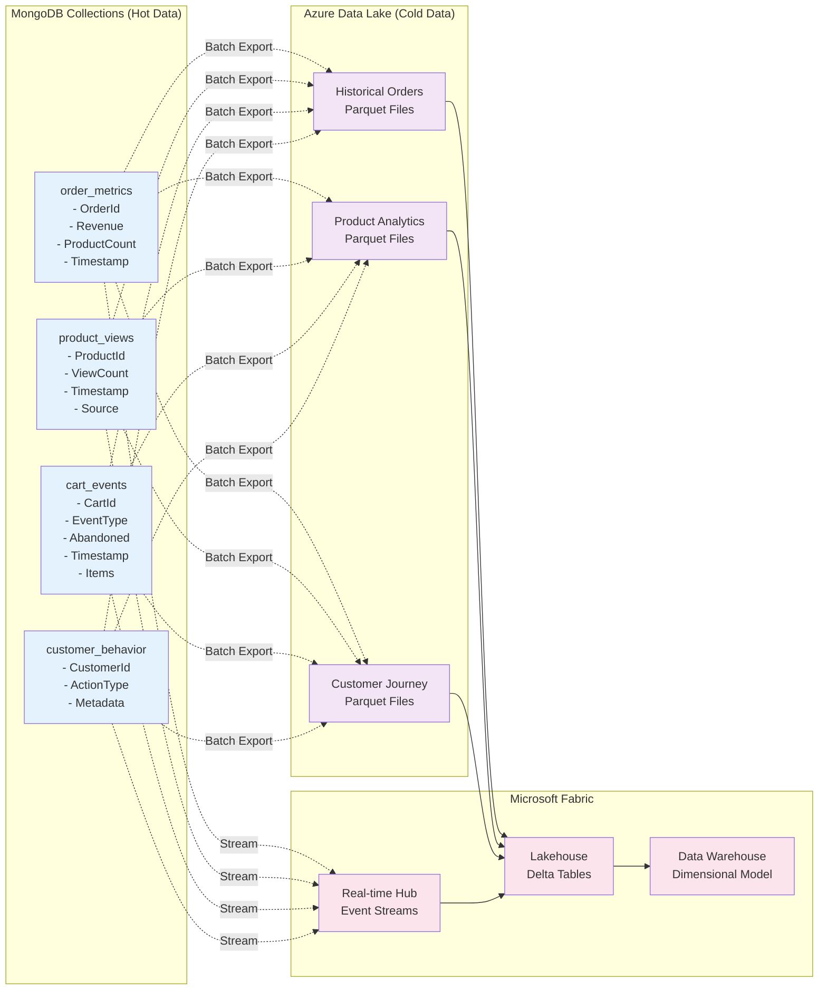

### Analytics Use Cases

```mermaid
flowchart TB
    subgraph "Real-time Analytics"
        RT1[Sales Dashboard<br/>Current day revenue]
        RT2[Product Performance<br/>Top sellers today]
        RT3[Cart Abandonment<br/>Live tracking]
        RT4[Customer Activity<br/>Active users]
    end
    
    subgraph "Batch Analytics"
        BA1[Trend Analysis<br/>Monthly/Yearly trends]
        BA2[Customer Segmentation<br/>RFM Analysis]
        BA3[Inventory Forecasting<br/>Demand prediction]
        BA4[Revenue Attribution<br/>Channel performance]
    end
    
    subgraph "Advanced Analytics (Fabric)"
        AA1[Machine Learning<br/>Product Recommendations]
        AA2[Predictive Analytics<br/>Churn Prediction]
        AA3[Anomaly Detection<br/>Fraud Detection]
        AA4[Cohort Analysis<br/>User Retention]
    end
    
    MONGO[(MongoDB<br/>Real-time Data)] --> RT1 & RT2 & RT3 & RT4
    LAKE[(Azure Data Lake<br/>Historical Data)] --> BA1 & BA2 & BA3 & BA4
    FABRIC[Microsoft Fabric<br/>Unified Analytics] --> AA1 & AA2 & AA3 & AA4
    
    style RT1 fill:#e3f2fd
    style RT2 fill:#e3f2fd
    style RT3 fill:#e3f2fd
    style RT4 fill:#e3f2fd
    style BA1 fill:#fff9c4
    style BA2 fill:#fff9c4
    style BA3 fill:#fff9c4
    style BA4 fill:#fff9c4
    style AA1 fill:#fce4ec
    style AA2 fill:#fce4ec
    style AA3 fill:#fce4ec
    style AA4 fill:#fce4ec
```

---

## Summary

These diagrams illustrate:

✅ **High-Level Architecture** - 8 microservices (7 .NET + 1 Java) with polyglot persistence  
✅ **Event-Driven Communication** - RabbitMQ-based async messaging  
✅ **Saga Pattern** - Distributed transaction handling with compensation  
✅ **Database-Per-Service** - Independent data stores (MongoDB + PostgreSQL)  
✅ **Analytics Architecture** - Real-time + batch analytics with Microsoft Fabric and Azure Data Lake  
✅ **Security** - JWT-based authentication and authorization  
✅ **Observability** - Centralized logging and distributed tracing  
✅ **Polyglot Architecture** - .NET and Java services working together  

For detailed implementation, see:
- [Analytics-Service-Implementation.md](../Services/Analytics-Service-Implementation.md) - Analytics service details
- [POLYGLOT_INTEGRATION.md](../Messaging/POLYGLOT_INTEGRATION.md) - Java/.NET integration
- [Event-Naming-Conventions.md](../Messaging/Event-Naming-Conventions.md) - Event contracts
- [MESSAGING_IMPLEMENTATION.md](../Messaging/MESSAGING_IMPLEMENTATION.md) - RabbitMQ patterns
- [SAGA_COMPENSATION_IMPLEMENTATION.md](../Messaging/SAGA_COMPENSATION_IMPLEMENTATION.md) - Saga implementation
