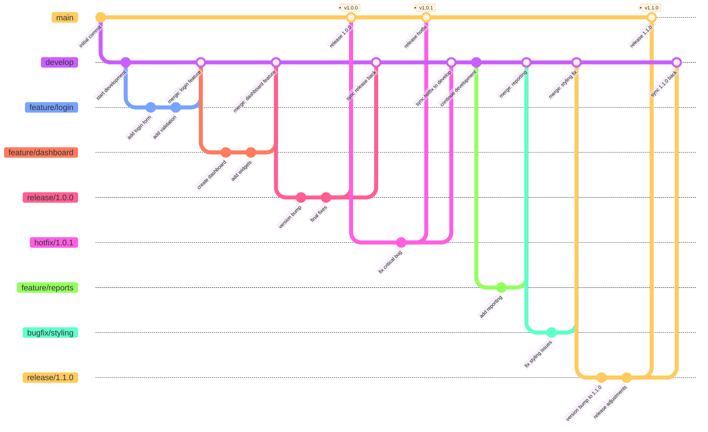

# GitFlow Branching Strategy

This document outlines the GitFlow branching strategy, a robust workflow design for managing feature development, releases, and hotfixes.

## Branch Types

- **`main` (or `master`)**: The production branch containing released code
- **`develop`**: The integration branch for development work
- **`feature/*`**: Short-lived branches for new features or improvements
- **`release/*`**: Preparation branches for upcoming releases
- **`hotfix/*`**: Emergency fixes for production issues
- **`bugfix/*`**: Non-critical bug fixes developed from `develop`

## Branching Model Visualization

## Workflow Description

### Main Development Flow

1. Development work happens on the `develop` branch
2. Features are created in `feature/*` branches from `develop`
3. When complete, features are merged back into `develop`

### Release Process

1. When `develop` has enough features, create a `release/*` branch
2. The release branch undergoes testing and final adjustments
3. When ready, merge into `main` and tag with a version number
4. Also merge back into `develop` to ensure fixes are in future releases

### Hotfix Process

1. For urgent production issues, create `hotfix/*` branches from `main`
2. Fix the issue and merge back to `main` with a version bump tag
3. Also merge into `develop` to include the fix in future releases

### Bug Fix Process

1. For non-urgent bugs, create `bugfix/*` branches from `develop` 
2. Fix the issue and merge back to `develop`

## Best Practices

1. **Branch Naming**:
   - `feature/descriptive-name` or `feature/JIRA-123-short-description`
   - `release/1.2.3` (using semantic versioning)
   - `hotfix/1.2.4` or `hotfix/critical-issue-description`
   - `bugfix/issue-description`

2. **Commit Guidelines**:
   - Write clear, concise commit messages
   - Reference issue/ticket numbers when applicable
   - Use conventional commit format: `type(scope): message`

3. **Merging Strategy**:
   - Use pull requests/merge requests for code review
   - Consider squashing feature commits when merging
   - Keep feature branches short-lived (days, not weeks)

4. **Tagging**:
   - Tag all releases on the `main` branch
   - Use semantic versioning: `v1.2.3`
   - Include release notes with tags when possible