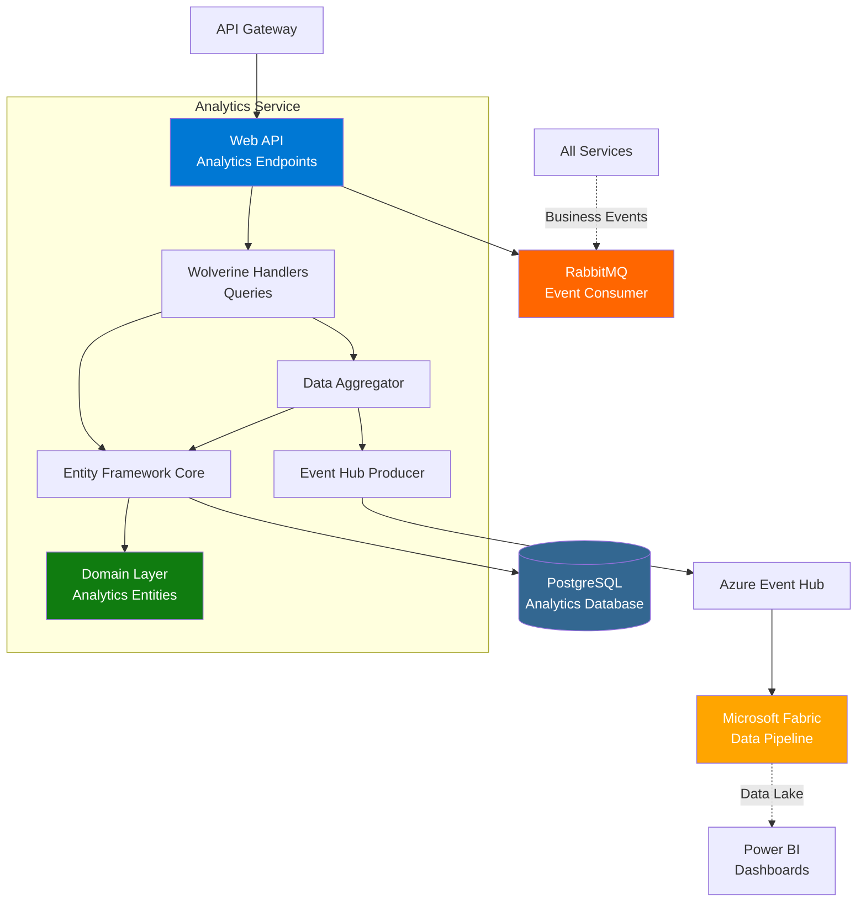
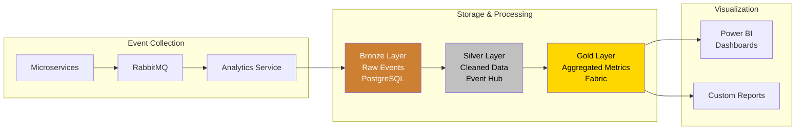
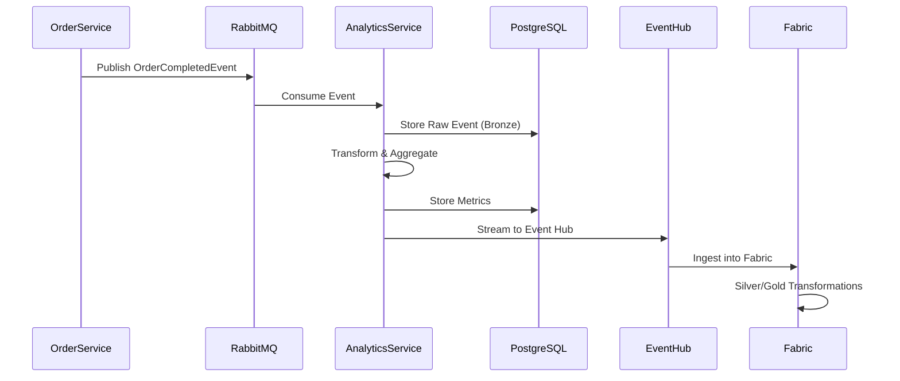
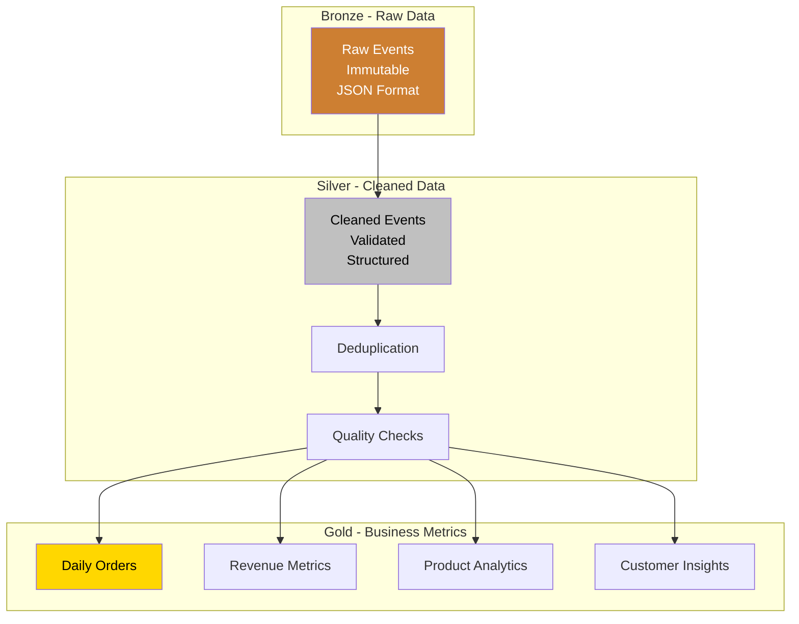

# Analytics Service Documentation

## Overview
The Analytics Service collects, processes, and analyzes business metrics from the microservices architecture. It consumes events from all services, aggregates data, and provides insights through dashboards and reports. Integration with Microsoft Fabric enables advanced analytics and data pipelines.

**Technology Stack**: .NET 10.0 | PostgreSQL | Entity Framework Core | MassTransit | RabbitMQ | Wolverine.net | Azure Event Hub | Microsoft Fabric | Aspire

## Architecture

### High-Level Architecture


### Data Pipeline Architecture


### Event Flow


### Medallion Architecture


## API Endpoints

### Analytics Queries

#### Get Analytics Summary
- **Endpoint**: `GET /api/analytics/summary`
- **Description**: Get overall business metrics summary
- **Query Parameters**:
  - `startDate` (DateTime, optional): Start date for metrics
  - `endDate` (DateTime, optional): End date for metrics
- **Response**: 
  - `200 OK`: Summary metrics
    ```json
    {
      "totalOrders": 1500,
      "totalRevenue": 125000.00,
      "averageOrderValue": 83.33,
      "totalCustomers": 450,
      "period": {
        "start": "2025-01-01",
        "end": "2025-01-31"
      }
    }
    ```
- **Authentication**: Required (JWT)

#### Get Daily Orders
- **Endpoint**: `GET /api/analytics/orders/daily`
- **Description**: Get daily order counts
- **Query Parameters**:
  - `days` (int, default: 30): Number of days to retrieve
- **Response**: 
  - `200 OK`: Daily order data
- **Authentication**: Required (JWT)

#### Get Daily Revenue
- **Endpoint**: `GET /api/analytics/revenue/daily`
- **Description**: Get daily revenue metrics
- **Query Parameters**:
  - `days` (int, default: 30): Number of days
- **Response**: 
  - `200 OK`: Daily revenue data
- **Authentication**: Required (JWT)

#### Get Popular Products
- **Endpoint**: `GET /api/analytics/products/popular`
- **Description**: Get most popular/best-selling products
- **Query Parameters**:
  - `top` (int, default: 10): Number of products
  - `period` (string): "day", "week", "month", "year"
- **Response**: 
  - `200 OK`: Product rankings with sales data
- **Authentication**: Required (JWT)

#### Health Check
- **Endpoint**: `GET /api/analytics/health`
- **Description**: Service health status
- **Response**: 
  - `200 OK`: Service healthy
- **Authentication**: Not required

## Libraries and Packages

### Core Framework
- **.NET 9.0**: Latest .NET runtime
- **ASP.NET Core**: Web API with Minimal APIs

### Database
- **Microsoft.EntityFrameworkCore**: ORM framework for PostgreSQL
- **Aspire.Npgsql.EntityFrameworkCore.PostgreSQL**: PostgreSQL with Aspire integration
- **Npgsql**: PostgreSQL .NET driver

### CQRS
- **Wolverine.net**: Query handling for analytics requests

### Messaging
- **MassTransit**: Event consumption from RabbitMQ
- **MassTransit.RabbitMQ**: RabbitMQ transport for consuming business events
- **Azure.Messaging.EventHubs**: Event Hub producer for streaming to Fabric
- **Azure.Messaging.EventHubs.Producer**: Event Hub client for data export

**Messaging Architecture**:
- **Inbound**: Consumes events from RabbitMQ (OrderCreated, PaymentProcessed, etc.)
- **Outbound**: Streams processed events to Azure Event Hub for Fabric integration

### .NET Aspire
- **Aspire ServiceDefaults**: Service configuration

### Analytics & Reporting
- **Microsoft.Data.Analysis**: Data analysis library
- **CsvHelper**: CSV export for reports

## Domain Model

### Analytics Event (Bronze Layer)
```csharp
public class AnalyticsEvent
{
    public Guid Id { get; set; }
    public string EventType { get; set; }
    public string EventData { get; set; } // JSON
    public DateTime OccurredAt { get; set; }
    public DateTime ReceivedAt { get; set; }
    public string SourceService { get; set; }
}
```

### Daily Order Metrics (Gold Layer)
```csharp
public class DailyOrderMetrics
{
    public Guid Id { get; set; }
    public DateTime Date { get; set; }
    public int TotalOrders { get; set; }
    public int CompletedOrders { get; set; }
    public int CancelledOrders { get; set; }
    public int FailedOrders { get; set; }
    public decimal TotalRevenue { get; set; }
    public decimal AverageOrderValue { get; set; }
}
```

### Product Analytics (Gold Layer)
```csharp
public class ProductAnalytics
{
    public Guid Id { get; set; }
    public Guid ProductId { get; set; }
    public string ProductName { get; set; }
    public DateTime PeriodStart { get; set; }
    public DateTime PeriodEnd { get; set; }
    public int TotalOrders { get; set; }
    public int TotalQuantitySold { get; set; }
    public decimal TotalRevenue { get; set; }
    public int UniqueCustomers { get; set; }
}
```

### Customer Insights (Gold Layer)
```csharp
public class CustomerInsights
{
    public Guid Id { get; set; }
    public Guid CustomerId { get; set; }
    public int TotalOrders { get; set; }
    public decimal TotalSpent { get; set; }
    public decimal AverageOrderValue { get; set; }
    public DateTime FirstOrderDate { get; set; }
    public DateTime LastOrderDate { get; set; }
    public string CustomerSegment { get; set; }
}
```

## Integration Events

### Consumed Events
All business events from all services:

1. **Order Events**
   - OrderCreatedEvent
   - OrderCompletedEvent
   - OrderCancelledEvent
   - OrderFailedEvent

2. **Payment Events**
   - PaymentProcessedEvent
   - PaymentFailedEvent
   - PaymentRefundedEvent

3. **Product Events**
   - ProductCreatedEvent
   - ProductUpdatedEvent
   - ProductViewedEvent

4. **Customer Events**
   - CustomerCreatedEvent
   - CustomerUpdatedEvent

5. **Cart Events**
   - CartItemAddedEvent
   - CartAbandonedEvent

### Published Events
- **AnalyticsProcessedEvent**: Signals metric calculation complete

## Data Aggregation

### Real-time Aggregation
```csharp
public class OrderAnalyticsAggregator
{
    public async Task ProcessOrderEvent(OrderCompletedEvent evt)
    {
        // Update real-time metrics
        await UpdateDailyMetrics(evt.OrderId, evt.TotalAmount);
        await UpdateProductMetrics(evt.Items);
        await UpdateCustomerMetrics(evt.CustomerId);
        
        // Stream to Event Hub for Fabric
        await _eventHubProducer.SendAsync(evt);
    }
}
```

### Batch Aggregation
- Scheduled jobs for historical data
- Daily rollups and aggregations
- Weekly/monthly trend analysis

## Microsoft Fabric Integration

### Event Hub Configuration
```json
{
  "EventHub": {
    "ConnectionString": "Endpoint=sb://...",
    "EventHubName": "analytics-events",
    "ProducerOptions": {
      "Identifier": "analytics-service"
    }
  }
}
```

### Fabric Pipeline Steps
1. **Ingest**: Event Hub → Fabric Eventstream
2. **Transform**: Databricks notebooks (silver layer)
3. **Aggregate**: SQL queries (gold layer)
4. **Visualize**: Power BI reports

### Transformation Notebooks
**Location**: `/notebooks/`

- `silver-transformations.py`: Clean and validate events
- `gold-transformations.py`: Aggregate business metrics

## Configuration

### Connection Strings
```json
{
  "ConnectionStrings": {
    "analyticsdb": "Host=localhost;Database=analyticsdb;Username=user;Password=pass",
    "eventhub": "Endpoint=sb://..."
  }
}
```

### Analytics Settings
```json
{
  "Analytics": {
    "AggregationInterval": "00:05:00",
    "RetentionDays": 365,
    "EventHubEnabled": true,
    "BatchSize": 100
  }
}
```

## Error Handling

### Analytics Errors
| Error | Handling |
|-------|----------|
| Event Processing Failure | Log, retry, dead letter queue |
| Database Connection Lost | Queue events, retry on reconnect |
| Event Hub Connection Lost | Buffer events, resume on connect |
| Invalid Event Data | Log, skip event, alert |

## Health Checks
- PostgreSQL connectivity
- RabbitMQ connectivity
- Event Hub connectivity
- Aggregation job status

## Monitoring

### Key Metrics
- Events processed per minute
- Event processing latency
- Failed event count
- Database query performance
- Event Hub throughput
- Aggregation job duration

### Dashboards

#### Power BI Dashboards
1. **Executive Dashboard**
   - Total revenue
   - Order trends
   - Customer growth
   - Product performance

2. **Operational Dashboard**
   - System health
   - Event processing rates
   - Error rates
   - Service dependencies

3. **Product Dashboard**
   - Best sellers
   - Inventory turnover
   - Price optimization
   - Category performance

## Testing

### Unit Tests
```csharp
[Test]
public async Task ShouldAggregateOrderMetrics()
{
    // Arrange
    var event = new OrderCompletedEvent { ... };
    
    // Act
    await _aggregator.ProcessOrderEvent(event);
    
    // Assert
    var metrics = await _dbContext.DailyOrderMetrics
        .FirstOrDefaultAsync(m => m.Date == event.OrderDate);
    Assert.That(metrics.TotalOrders, Is.EqualTo(1));
}
```

### Integration Tests
- Event consumption tests
- Database aggregation tests
- Event Hub integration tests

## Best Practices

### Data Collection
- ✅ Store raw events (immutability)
- ✅ Version event schemas
- ✅ Handle duplicate events
- ✅ Timestamp all events
- ✅ Validate event data

### Performance
- ✅ Use batch processing
- ✅ Index frequently queried columns
- ✅ Partition large tables by date
- ✅ Use materialized views
- ✅ Cache frequently accessed metrics

### Data Quality
- ✅ Validate incoming events
- ✅ Handle missing data
- ✅ Detect anomalies
- ✅ Audit data transformations
- ✅ Monitor data freshness

## Development

### Local Development
1. Start PostgreSQL
2. Run migrations: `dotnet ef database update`
3. Configure Event Hub (optional)
4. Run: `dotnet run`

### Database Migrations
```bash
dotnet ef migrations add AddProductAnalytics
dotnet ef database update
```

## Fabric Integration Setup

### Prerequisites
- Azure subscription
- Microsoft Fabric workspace
- Event Hub namespace

### Setup Steps
1. Create Event Hub
2. Configure Fabric Eventstream
3. Create Databricks workspace
4. Deploy transformation notebooks
5. Create Lakehouse
6. Build Power BI reports

**Detailed Guide**: See [`docs/Analytics/`](../Analytics/)

## Performance Optimization

### Database Optimization
```sql
-- Partition by date
CREATE TABLE daily_order_metrics (
    date DATE NOT NULL,
    -- columns
) PARTITION BY RANGE (date);

-- Indexes
CREATE INDEX idx_events_occurred_at 
    ON analytics_events(occurred_at);
CREATE INDEX idx_product_analytics_period 
    ON product_analytics(period_start, period_end);
```

### Query Optimization
- Use date range filters
- Limit result sets
- Use pagination
- Cache frequently accessed data

## Security

### Data Protection
- Encrypt sensitive analytics data
- PII anonymization
- Role-based access to reports
- Audit log access

### Compliance
- GDPR data retention policies
- Right to be forgotten
- Data export capabilities

## Future Enhancements
- [ ] Real-time analytics dashboards
- [ ] Predictive analytics (ML models)
- [ ] Customer segmentation
- [ ] Anomaly detection
- [ ] A/B testing analytics
- [ ] Revenue forecasting
- [ ] Churn prediction
- [ ] Recommendation engine data
- [ ] Advanced cohort analysis
- [ ] Custom report builder
