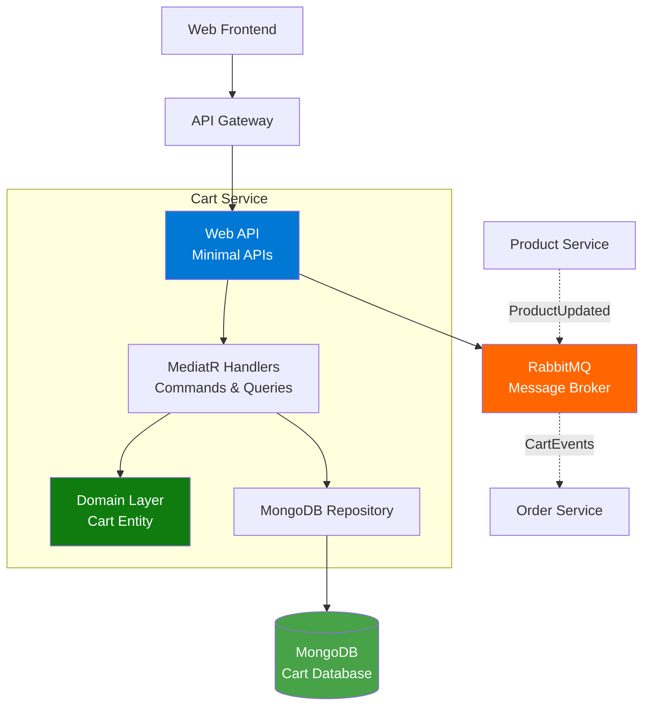
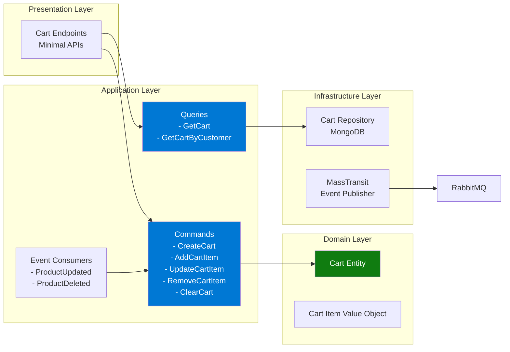
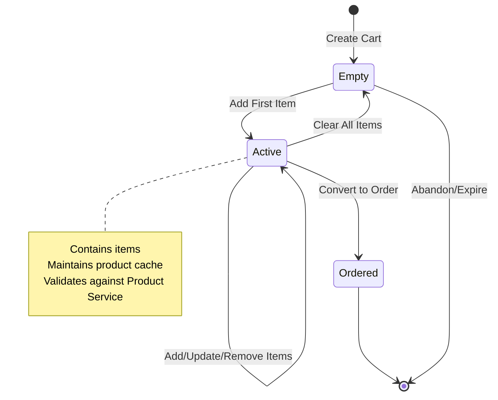
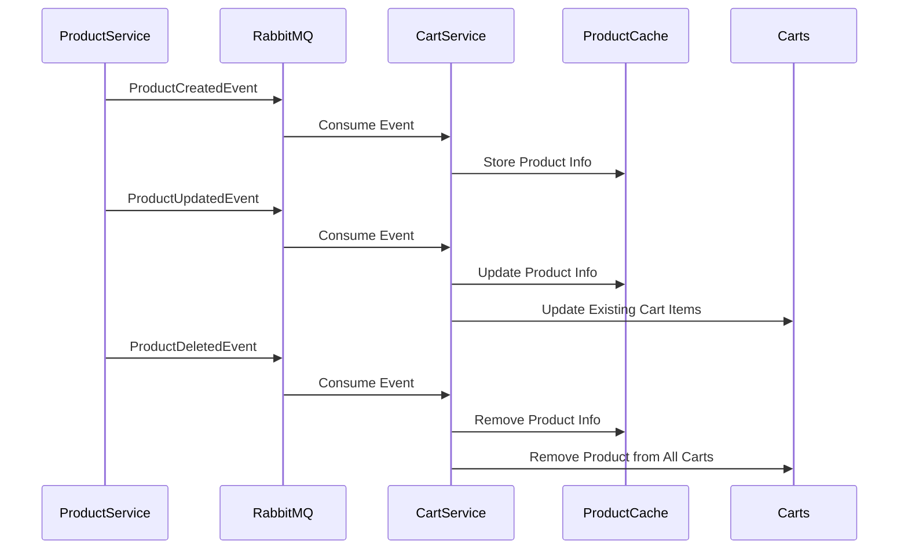

# Cart Service Documentation

## Overview
The Cart Service manages shopping carts for customers, handling cart creation, item management, and integration with product information. It acts as a temporary storage for customer selections before order placement.

**Technology Stack**: .NET 10.0 | MongoDB | MassTransit | RabbitMQ | MediatR | Product Cache | Aspire

## Architecture

### High-Level Architecture


### Component Architecture


### Cart Lifecycle


## API Endpoints

### Cart Management

#### Get Current User's Cart
- **Endpoint**: `GET /api/carts/me`
- **Description**: Get the cart for the currently authenticated user
- **Response**: 
  - `200 OK`: Cart details with items
  - `401 Unauthorized`: User not authenticated
- **Authentication**: Required (JWT)

#### Get Cart by ID
- **Endpoint**: `GET /api/carts/{id}`
- **Description**: Retrieve a specific cart by ID
- **Path Parameters**:
  - `id` (Guid): Cart ID
- **Response**: 
  - `200 OK`: Cart details
  - `404 Not Found`: Cart not found
- **Authentication**: Required (JWT)

#### Get Cart by Customer ID
- **Endpoint**: `GET /api/carts/customer/{customerId}`
- **Description**: Retrieve cart for a specific customer
- **Path Parameters**:
  - `customerId` (Guid): Customer ID
- **Response**: 
  - `200 OK`: Cart details
  - `404 Not Found`: No cart for customer
- **Authentication**: Required (JWT)

#### Create Cart
- **Endpoint**: `POST /api/carts`
- **Description**: Create a new cart for a customer
- **Request Body**:
  ```json
  {
    "customerId": "guid"
  }
  ```
- **Response**: 
  - `201 Created`: Location header with cart URL
  - `400 Bad Request`: Validation errors
- **Authentication**: Required (JWT)

#### Add Item to Cart
- **Endpoint**: `POST /api/carts/{cartId}/items`
- **Description**: Add a product to the cart
- **Path Parameters**:
  - `cartId` (Guid): Cart ID
- **Request Body**:
  ```json
  {
    "productId": "guid",
    "quantity": 1
  }
  ```
- **Response**: 
  - `200 OK`: Updated cart
  - `404 Not Found`: Cart or product not found
  - `400 Bad Request`: Insufficient stock
- **Authentication**: Required (JWT)

#### Add Item to Current User's Cart
- **Endpoint**: `POST /api/carts/items`
- **Description**: Add item to authenticated user's cart (creates cart if needed)
- **Request Body**:
  ```json
  {
    "productId": "guid",
    "quantity": 1
  }
  ```
- **Response**: 
  - `200 OK`: Updated cart
  - `400 Bad Request`: Product not found or insufficient stock
- **Authentication**: Required (JWT)

#### Update Cart Item Quantity
- **Endpoint**: `PUT /api/carts/{cartId}/items/{productId}`
- **Description**: Update quantity of a specific item
- **Path Parameters**:
  - `cartId` (Guid): Cart ID
  - `productId` (Guid): Product ID
- **Request Body**:
  ```json
  {
    "quantity": 3
  }
  ```
- **Response**: 
  - `200 OK`: Updated cart
  - `404 Not Found`: Cart or item not found
  - `400 Bad Request`: Invalid quantity or insufficient stock
- **Authentication**: Required (JWT)

#### Remove Cart Item
- **Endpoint**: `DELETE /api/carts/{cartId}/items/{productId}`
- **Description**: Remove a product from the cart
- **Path Parameters**:
  - `cartId` (Guid): Cart ID
  - `productId` (Guid): Product ID
- **Response**: 
  - `200 OK`: Updated cart
  - `404 Not Found`: Cart or item not found
- **Authentication**: Required (JWT)

#### Clear Cart
- **Endpoint**: `DELETE /api/carts/{cartId}`
- **Description**: Remove all items from a cart
- **Path Parameters**:
  - `cartId` (Guid): Cart ID
- **Response**: 
  - `204 No Content`: Cart cleared
  - `404 Not Found`: Cart not found
- **Authentication**: Required (JWT)

## Libraries and Packages

### Core Framework
- **.NET 10.0**: Latest .NET runtime
- **ASP.NET Core**: Web API with Minimal APIs

### CQRS and Messaging
- **MediatR**: Command/Query handling pattern
- **MassTransit**: Message bus abstraction
- **MassTransit.RabbitMQ**: RabbitMQ transport

### Database
- **MongoDB.Driver**: Official MongoDB C# driver
- **Aspire.MongoDB.Driver**: .NET Aspire MongoDB integration

### API Documentation
- **Scalar.AspNetCore**: Modern API documentation UI
- **Microsoft.AspNetCore.OpenApi**: OpenAPI support

### Authentication
- **Microsoft.AspNetCore.Authentication.JwtBearer**: JWT authentication

### .NET Aspire
- **Aspire ServiceDefaults**: Service configuration standards

## Key Features

### Product Cache Synchronization
The Cart Service maintains a local cache of product information to ensure cart items have accurate, up-to-date product details without constantly querying the Product Service.

**Cache Update Flow**:


**Benefits**:
- Fast cart operations without external service calls
- Automatic price and name updates when products change
- Automatic removal of deleted products from carts
- Resilience to Product Service downtime

**Event Consumers**:
- `ProductCreatedEventConsumer`: Adds new products to cache
- `ProductUpdatedEventConsumer`: Updates product info and cart items
- `ProductDeletedEventConsumer`: Removes deleted products from all carts

### Cart Clearing on Order Creation
When an order is created, the cart is automatically cleared:
- `OrderCreatedEventConsumer`: Listens for order creation events
- Clears the customer's cart after successful order placement
- Ensures users start with a fresh cart for next purchase

## Domain Model

### Cart Entity
```csharp
public class Cart
{
    public Guid Id { get; }
    public Guid CustomerId { get; }
    public List<CartItem> Items { get; }
    public decimal TotalAmount { get; }
    public DateTime CreatedAt { get; }
    public DateTime UpdatedAt { get; }
}
```

### Cart Item Value Object
```csharp
public class CartItem
{
    public Guid ProductId { get; }
    public string ProductName { get; }
    public decimal Price { get; }
    public int Quantity { get; }
    public decimal Subtotal { get; }
}
```

## Integration Events

### Published Events
1. **CartItemAdded**: Published when item is added
2. **CartItemUpdated**: Published when quantity changes
3. **CartItemRemoved**: Published when item is removed
4. **CartCleared**: Published when cart is emptied

### Consumed Events
1. **ProductUpdatedEvent**: Updates cached product info in carts
2. **ProductDeletedEvent**: Removes deleted products from carts
3. **ProductPriceChangedEvent**: Updates prices in existing carts

## Features

### Product Cache
- Caches product name and price in cart items
- Automatically updates when product information changes
- Reduces dependency on Product Service for cart display

### Stock Validation
- Validates product availability before adding to cart
- Checks stock levels in real-time
- Prevents adding unavailable products

### Customer Association
- Each cart is tied to a customer ID
- Supports guest carts (anonymous customers)
- Automatic cart retrieval for logged-in users

## Configuration

### Connection Strings
- **cartdb**: MongoDB connection (via Aspire)
- **messaging**: RabbitMQ connection (via Aspire)

### JWT Configuration
```json
{
  "Jwt": {
    "SecretKey": "your-secret-key",
    "Issuer": "your-issuer",
    "Audience": "your-audience"
  }
}
```

## Error Handling

### Common Errors
| Error | HTTP Status | Description |
|-------|-------------|-------------|
| Cart Not Found | 404 | Specified cart ID doesn't exist |
| Product Not Found | 404 | Product no longer available |
| Insufficient Stock | 400 | Requested quantity exceeds stock |
| Invalid Quantity | 400 | Quantity must be positive |
| Unauthorized | 401 | JWT token missing or invalid |

## Health Checks
- MongoDB connectivity
- RabbitMQ connectivity
- Service readiness

## Development

### Local Development
1. Ensure MongoDB and RabbitMQ are running
2. Configure connection strings
3. Run: `dotnet run`
4. Access API docs: `http://localhost:<port>/scalar/v1`

### Testing
- Unit tests for domain logic
- Integration tests with MongoDB TestContainers
- End-to-end tests for complete cart workflows
