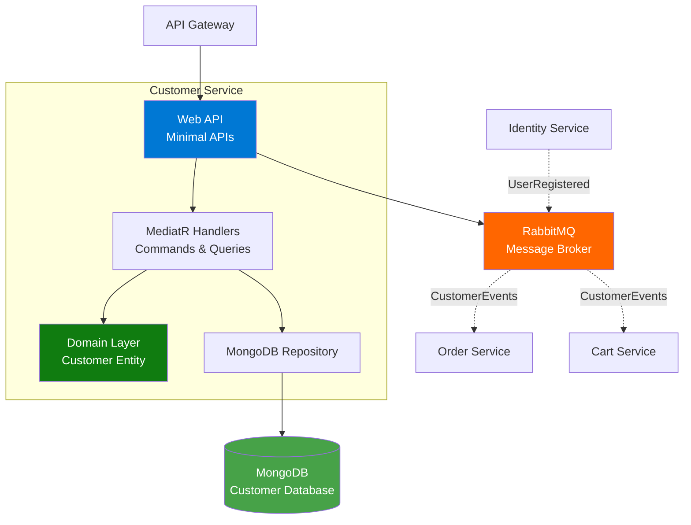
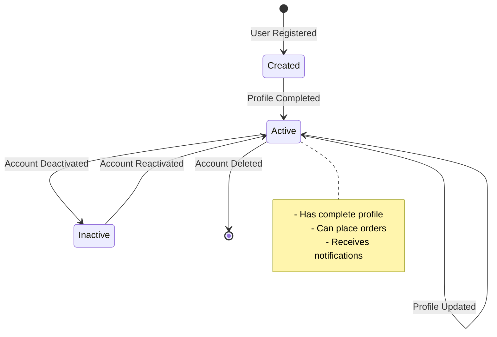
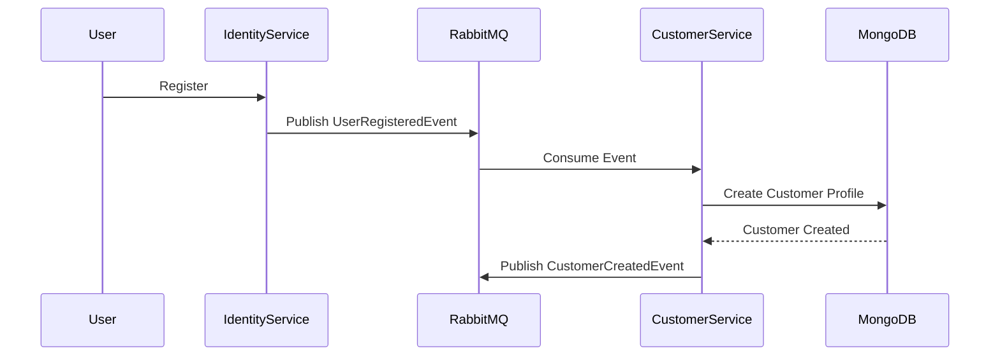

# Customer Service Documentation

## Overview
The Customer Service manages customer profiles, addresses, and customer-related information. It synchronizes with the Identity Service and provides customer data to other services in the system.

**Technology Stack**: .NET 10.0 | MongoDB | MassTransit | RabbitMQ | MediatR | FluentValidation | Aspire

## Architecture

### High-Level Architecture


### Customer Lifecycle


### Customer Creation Flow


## API Endpoints

### Customer Management

#### Health Check
- **Endpoint**: `GET /api/customers/health`
- **Description**: Check service health
- **Response**: 
  - `200 OK`: Service healthy
- **Authentication**: Not required

#### Get Customer by ID
- **Endpoint**: `GET /api/customers/{id}`
- **Description**: Retrieve customer profile by ID
- **Path Parameters**:
  - `id` (Guid): Customer ID
- **Response**: 
  - `200 OK`: Customer profile
  - `404 Not Found`: Customer not found
- **Authentication**: Required (JWT)

#### Get Current Customer
- **Endpoint**: `GET /api/customers/me`
- **Description**: Get current authenticated customer's profile
- **Response**: 
  - `200 OK`: Customer profile
  - `401 Unauthorized`: Not authenticated
  - `404 Not Found`: Customer profile not found
- **Authentication**: Required (JWT)

#### Update Customer
- **Endpoint**: `PUT /api/customers/{id}`
- **Description**: Update customer profile
- **Path Parameters**:
  - `id` (Guid): Customer ID
- **Request Body**:
  ```json
  {
    "firstName": "John",
    "lastName": "Doe",
    "phoneNumber": "+1234567890",
    "dateOfBirth": "1990-01-01"
  }
  ```
- **Response**: 
  - `200 OK`: Updated customer profile
  - `400 Bad Request`: Validation errors
  - `404 Not Found`: Customer not found
- **Authentication**: Required (JWT)

#### Add Address
- **Endpoint**: `POST /api/customers/{id}/addresses`
- **Description**: Add a new address to customer profile
- **Path Parameters**:
  - `id` (Guid): Customer ID
- **Request Body**:
  ```json
  {
    "type": "Shipping",
    "street": "123 Main St",
    "city": "Anytown",
    "state": "CA",
    "postalCode": "12345",
    "country": "USA",
    "isDefault": true
  }
  ```
- **Response**: 
  - `201 Created`: Address added
  - `400 Bad Request`: Validation errors
- **Authentication**: Required (JWT)

#### Update Address
- **Endpoint**: `PUT /api/customers/{customerId}/addresses/{addressId}`
- **Description**: Update an existing address
- **Path Parameters**:
  - `customerId` (Guid): Customer ID
  - `addressId` (Guid): Address ID
- **Request Body**: Same as Add Address
- **Response**: 
  - `200 OK`: Address updated
  - `404 Not Found`: Customer or address not found
- **Authentication**: Required (JWT)

#### Delete Address
- **Endpoint**: `DELETE /api/customers/{customerId}/addresses/{addressId}`
- **Description**: Remove an address from customer profile
- **Path Parameters**:
  - `customerId` (Guid): Customer ID
  - `addressId` (Guid): Address ID
- **Response**: 
  - `204 No Content`: Address deleted
  - `404 Not Found`: Customer or address not found
- **Authentication**: Required (JWT)

## Libraries and Packages

### Core Framework
- **.NET 10.0**: Latest .NET runtime
- **ASP.NET Core**: Web API with Minimal APIs

### CQRS and Validation
- **MediatR**: Command/Query handling
- **FluentValidation.DependencyInjectionExtensions**: Request validation

### Error Handling
- **ErrorOr**: Functional error handling pattern

### Messaging
- **MassTransit**: Message bus abstraction
- **MassTransit.RabbitMQ**: RabbitMQ transport

### Database
- **MongoDB.Driver**: Official MongoDB driver
- **Aspire.MongoDB.Driver**: .NET Aspire MongoDB integration

### API Documentation
- **Scalar.AspNetCore**: Modern API documentation
- **Microsoft.AspNetCore.OpenApi**: OpenAPI support

### Authentication
- **Microsoft.AspNetCore.Authentication.JwtBearer**: JWT authentication
- **Microsoft.IdentityModel.Tokens**: Token validation

### .NET Aspire
- **Aspire ServiceDefaults**: Service configuration

## Domain Model

### Customer Entity
```csharp
public class Customer
{
    public Guid Id { get; }
    public Guid UserId { get; }
    public string FirstName { get; }
    public string LastName { get; }
    public string Email { get; }
    public string? PhoneNumber { get; }
    public DateTime? DateOfBirth { get; }
    public List<Address> Addresses { get; }
    public CustomerStatus Status { get; }
    public DateTime CreatedAt { get; }
    public DateTime UpdatedAt { get; }
}
```

### Address Value Object
```csharp
public class Address
{
    public Guid Id { get; }
    public AddressType Type { get; }
    public string Street { get; }
    public string? Street2 { get; }
    public string City { get; }
    public string State { get; }
    public string PostalCode { get; }
    public string Country { get; }
    public bool IsDefault { get; }
}

public enum AddressType
{
    Shipping,
    Billing,
    Both
}
```

### Customer Status
```csharp
public enum CustomerStatus
{
    Active,
    Inactive,
    Suspended,
    Deleted
}
```

## Integration Events

### Published Events
1. **CustomerCreatedEvent**
   ```json
   {
     "customerId": "guid",
     "userId": "guid",
     "email": "string",
     "firstName": "string",
     "lastName": "string",
     "createdAt": "datetime"
   }
   ```

2. **CustomerUpdatedEvent**
   ```json
   {
     "customerId": "guid",
     "updatedFields": ["firstName", "phoneNumber"],
     "updatedAt": "datetime"
   }
   ```

3. **CustomerAddressAddedEvent**
   ```json
   {
     "customerId": "guid",
     "addressId": "guid",
     "addressType": "Shipping",
     "isDefault": true
   }
   ```

### Consumed Events
1. **OrderCreatedEvent**: Track customer order history and activity

**Note**: The Customer Service currently consumes OrderCreated events to maintain customer order history. It does not consume UserRegistered events (no integration with Identity Service yet) and does not publish events.

## Features

### Profile Management
- Complete customer profile information
- Multiple addresses support
- Default address selection
- Profile validation

### Address Management
- Multiple addresses per customer
- Address types (Shipping, Billing, Both)
- Default address selection
- Address validation and standardization

### Data Synchronization
- Automatic profile creation on user registration
- Sync with Identity Service changes
- Event-driven updates

## Configuration

### Connection Strings
```json
{
  "ConnectionStrings": {
    "customerdb": "mongodb://localhost:27017/customerdb",
    "messaging": "amqp://localhost:5672"
  }
}
```

### JWT Configuration
```json
{
  "Jwt": {
    "SecretKey": "your-secret-key",
    "Issuer": "your-issuer",
    "Audience": "your-audience"
  }
}
```

## Error Handling

### Customer Errors
| Error | HTTP Status | Description |
|-------|-------------|-------------|
| Customer Not Found | 404 | Customer ID doesn't exist |
| Address Not Found | 404 | Address ID doesn't exist |
| Duplicate Address | 409 | Address already exists |
| Invalid Phone Number | 400 | Phone number format invalid |
| Invalid Address | 400 | Address validation failed |
| Unauthorized | 401 | Not authenticated |
| Forbidden | 403 | Cannot access other customer's data |

## Validation Rules

### Customer Profile
- First name: Required, 2-50 characters
- Last name: Required, 2-50 characters
- Phone number: Optional, valid format
- Date of birth: Optional, must be in past

### Address
- Street: Required, max 200 characters
- City: Required, max 100 characters
- State: Required, 2-50 characters
- Postal code: Required, valid format
- Country: Required, 2-50 characters

## Health Checks
- MongoDB connectivity
- RabbitMQ connectivity
- Service readiness

## Monitoring

### Key Metrics
- Customer profile creation rate
- Profile update frequency
- Address additions per customer
- Data sync success rate

### Alerts
- Failed profile synchronization
- High validation error rate
- Database connection issues

## Testing

### Unit Tests
- Domain model validation
- Address validation logic
- Business rules

### Integration Tests
- Customer creation flow
- Address management operations
- Event consumption and publishing
- MongoDB operations

## Best Practices

### Profile Management
- ✅ Validate all inputs
- ✅ Sanitize user data
- ✅ Maintain data consistency with Identity Service
- ✅ Support profile versioning
- ✅ Audit profile changes

### Address Management
- ✅ Validate address format
- ✅ Support international addresses
- ✅ Enforce default address rules
- ✅ Allow multiple address types
- ✅ Geocode addresses for accuracy

### Security
- ✅ Customers can only access own data
- ✅ Admin role for customer service access
- ✅ PII data encryption at rest
- ✅ GDPR compliance for data deletion

## Development

### Local Development
1. Ensure MongoDB and RabbitMQ are running
2. Configure connection strings
3. Start Identity Service (for events)
4. Run: `dotnet run`
5. Access API docs: `http://localhost:<port>/scalar/v1`

### Testing
```bash
dotnet test
```

## Data Privacy

### GDPR Compliance
- Right to access: Export customer data
- Right to deletion: Delete customer profile
- Right to rectification: Update profile
- Data portability: Export in standard format

### PII Protection
- Encrypt sensitive fields
- Mask data in logs
- Secure data transmission
- Regular security audits

## Future Enhancements
- [ ] Customer preferences management
- [ ] Order history integration
- [ ] Loyalty program support
- [ ] Customer segmentation
- [ ] Address geocoding and validation
- [ ] Customer communication preferences
- [ ] Multi-language support
- [ ] Customer analytics dashboard
