# Identity Service Documentation

## Overview
The Identity Service handles user authentication, authorization, and JWT token management for the microservices architecture. It provides secure user registration, login, and token validation services.

**Technology Stack**: .NET 10.0 | MongoDB | JWT Authentication | BCrypt | Wolverine.net | Aspire

## Architecture

### High-Level Architecture

```mermaid
graph TB
    subgraph "Identity Service"
        API[Web API<br/>Auth Endpoints]
        AuthService[Authentication Service]
        UserRepo[User Repository]
        TokenService[JWT Token Service]
        Domain[Domain Layer<br/>User Entity]
        
        API --> AuthService
        AuthService --> UserRepo
        AuthService --> TokenService
        UserRepo --> Domain
    end
    
    UserRepo --> MongoDB[(MongoDB<br/>User Database)]
    
    Gateway[API Gateway] --> API
    AllServices[All Services] -.->|Token Validation| API
    
    style API fill:#0078d4,color:#fff
    style Domain fill:#107c10,color:#fff
    style MongoDB fill:#47A248,color:#fff
```


### Authentication Flow


### Registration Flow


### Token Structure


## API Endpoints

### Authentication

#### Register User
- **Endpoint**: `POST /api/auth/register`
- **Description**: Register a new user account
- **Request Body**:
  ```json
  {
    "email": "user@example.com",
    "password": "SecurePassword123!",
    "firstName": "John",
    "lastName": "Doe"
  }
  ```
- **Response**: 
  - `201 Created`: User created with JWT token
  - `409 Conflict`: Email already exists
  - `400 Bad Request`: Validation errors
- **Authentication**: Not required

#### Login
- **Endpoint**: `POST /api/auth/login`
- **Description**: Authenticate user and receive JWT token
- **Request Body**:
  ```json
  {
    "email": "user@example.com",
    "password": "SecurePassword123!"
  }
  ```
- **Response**: 
  - `200 OK`: JWT token and user info
    ```json
    {
      "token": "eyJhbGciOiJIUzI1NiIs...",
      "user": {
        "id": "guid",
        "email": "user@example.com",
        "firstName": "John",
        "lastName": "Doe",
        "role": "Customer"
      }
    }
    ```
  - `401 Unauthorized`: Invalid credentials
  - `400 Bad Request`: Validation errors
- **Authentication**: Not required

#### Get Current User
- **Endpoint**: `GET /api/auth/me`
- **Description**: Get current authenticated user's information
- **Response**: 
  - `200 OK`: User details
  - `401 Unauthorized`: Invalid or missing token
- **Authentication**: Required (JWT)

#### Check Admin Exists (Debug)
- **Endpoint**: `GET /api/auth/debug/admin-exists`
- **Description**: Check if admin user exists in system
- **Response**: 
  - `200 OK`: Boolean result
- **Authentication**: Not required
- **Note**: Debug endpoint, should be removed in production

## Key Features

### Admin User Seeder
The Identity Service automatically creates a default admin user on startup if none exists.

**Default Admin Credentials**:
- Email: `admin@productordering.com`
- Password: `Admin123!`
- Role: Admin

**Seeder Behavior**:
- Runs as a background service on application startup
- Checks for existing admin user
- Creates admin only if no admin exists
- Uses secure password hashing (BCrypt)
- Logs success/failure

**Note**: Change the default admin password immediately after first deployment to production.

## Libraries and Packages

### Core Framework
- **.NET 10.0**: Latest .NET runtime
- **ASP.NET Core**: Web API with Minimal APIs
- **Wolverine.net**: Command handling for authentication operations

### Database
- **MongoDB.Driver**: Official MongoDB driver
- **Aspire.MongoDB.Driver**: .NET Aspire MongoDB integration

### Security
- **Microsoft.AspNetCore.Authentication.JwtBearer**: JWT authentication
- **BCrypt.Net**: Password hashing and verification (10 salt rounds)
- **Microsoft.IdentityModel.Tokens**: Token generation and validation
- **System.IdentityModel.Tokens.Jwt**: JWT token creation

### API Documentation
- **Scalar.AspNetCore**: Modern API documentation
- **Microsoft.AspNetCore.OpenApi**: OpenAPI support

### .NET Aspire
- **Aspire ServiceDefaults**: Service configuration

**Note**: Identity Service does not use RabbitMQ or event publishing. It's a standalone authentication service.

## Domain Model

### User Entity
```csharp
public class User
{
    public Guid Id { get; }
    public string Email { get; }
    public string PasswordHash { get; }
    public string FirstName { get; }
    public string LastName { get; }
    public UserRole Role { get; }
    public bool IsActive { get; }
    public DateTime CreatedAt { get; }
    public DateTime? LastLoginAt { get; }
}
```

### User Roles
```csharp
public enum UserRole
{
    Customer,
    Admin,
    Support
}
```

### JWT Claims
- **sub**: User ID (GUID)
- **email**: User email address
- **given_name**: First name
- **family_name**: Last name
- **role**: User role
- **exp**: Token expiration timestamp
- **iss**: Token issuer
- **aud**: Token audience

## Security Features

### Password Security
- **BCrypt Hashing**: Industry-standard password hashing
- **Salting**: Automatic salt generation per password
- **Work Factor**: Configurable computational cost
- **One-way**: Passwords cannot be reversed

### JWT Token Security
- **HMAC SHA256 Signature**: Cryptographic signature
- **Token Expiration**: Configurable lifetime (default: 7 days)
- **Claims-based**: Role and permission claims
- **Stateless**: No server-side session storage

### API Security
- **HTTPS Only**: Enforce TLS in production
- **CORS Configuration**: Restricted cross-origin requests
- **Rate Limiting**: Prevent brute force attacks
- **Input Validation**: Sanitize all inputs

## Configuration

### JWT Settings
```json
{
  "Jwt": {
    "SecretKey": "your-256-bit-secret-key-here",
    "Issuer": "ProductOrderingSystem.IdentityService",
    "Audience": "ProductOrderingSystem.API",
    "ExpirationDays": 7
  }
}
```

### MongoDB Connection
```json
{
  "ConnectionStrings": {
    "identitydb": "mongodb://localhost:27017/identitydb"
  }
}
```

### Password Policy
```json
{
  "PasswordPolicy": {
    "MinimumLength": 8,
    "RequireUppercase": true,
    "RequireLowercase": true,
    "RequireDigit": true,
    "RequireSpecialCharacter": true
  }
}
```

## Error Handling

### Authentication Errors
| Error | HTTP Status | Description |
|-------|-------------|-------------|
| Invalid Credentials | 401 | Email or password incorrect |
| Email Already Exists | 409 | Registration with existing email |
| Token Expired | 401 | JWT token has expired |
| Invalid Token | 401 | JWT token is malformed or invalid |
| Weak Password | 400 | Password doesn't meet policy |
| Account Inactive | 403 | User account is disabled |

## Health Checks
- MongoDB connectivity
- RabbitMQ connectivity
- JWT signing key validation
- Service readiness

## Token Validation

### For Consuming Services
Other services validate JWT tokens using shared secret:

```csharp
services.AddAuthentication(JwtBearerDefaults.AuthenticationScheme)
    .AddJwtBearer(options =>
    {
        options.TokenValidationParameters = new TokenValidationParameters
        {
            ValidateIssuer = true,
            ValidateAudience = true,
            ValidateLifetime = true,
            ValidateIssuerSigningKey = true,
            ValidIssuer = config["Jwt:Issuer"],
            ValidAudience = config["Jwt:Audience"],
            IssuerSigningKey = new SymmetricSecurityKey(
                Encoding.UTF8.GetBytes(config["Jwt:SecretKey"]))
        };
    });
```

## Development

### Initial Setup
1. Configure MongoDB connection
2. Set JWT secret key (use strong random value)
3. Configure password policy
4. Run migrations (if any)
5. Seed admin user (optional)

### Local Development
```bash
dotnet run
```

### Create Admin User
```bash
curl -X POST http://localhost:<port>/api/auth/register \
  -H "Content-Type: application/json" \
  -d '{
    "email": "admin@example.com",
    "password": "Admin123!",
    "firstName": "Admin",
    "lastName": "User"
  }'
```

### Testing
- Unit tests for password hashing
- Integration tests for authentication flow
- Token generation and validation tests
- Security penetration tests

## Best Practices

### Security
- ✅ Never log passwords or tokens
- ✅ Use HTTPS in production
- ✅ Rotate JWT secret keys periodically
- ✅ Implement token refresh mechanism
- ✅ Set appropriate token expiration
- ✅ Validate all inputs
- ✅ Use prepared statements (MongoDB)
- ✅ Implement rate limiting

### Password Management
- ✅ Enforce strong password policy
- ✅ Never store plain-text passwords
- ✅ Use BCrypt with appropriate work factor
- ✅ Implement password reset flow
- ✅ Consider multi-factor authentication

### Token Management
- ✅ Keep tokens short-lived
- ✅ Implement token refresh
- ✅ Revoke tokens on logout
- ✅ Use secure, random secret keys
- ✅ Include minimal claims in payload

## Monitoring

### Key Metrics
- Failed login attempts
- Registration rate
- Token generation rate
- Token validation failures
- Average authentication time

### Security Monitoring
- Monitor failed login patterns
- Alert on unusual registration activity
- Track token validation failures
- Log all authentication events

## Future Enhancements
- [ ] Multi-factor authentication (MFA)
- [ ] OAuth2 integration
- [ ] Password reset flow
- [ ] Email verification
- [ ] Account lockout after failed attempts
- [ ] Token refresh mechanism
- [ ] Social login (Google, Microsoft, etc.)
- [ ] RBAC (Role-Based Access Control) refinement
