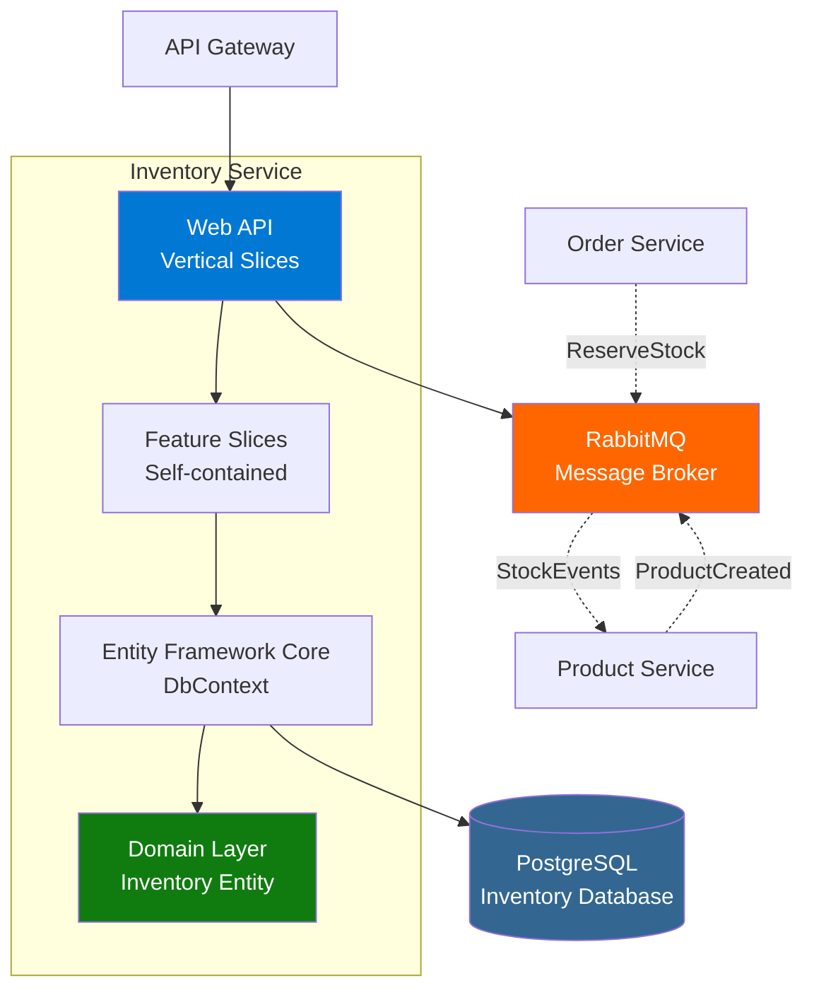
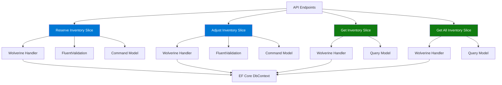
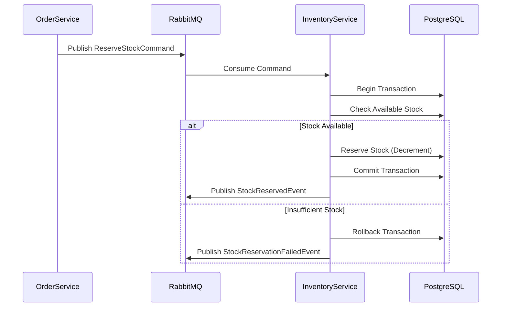
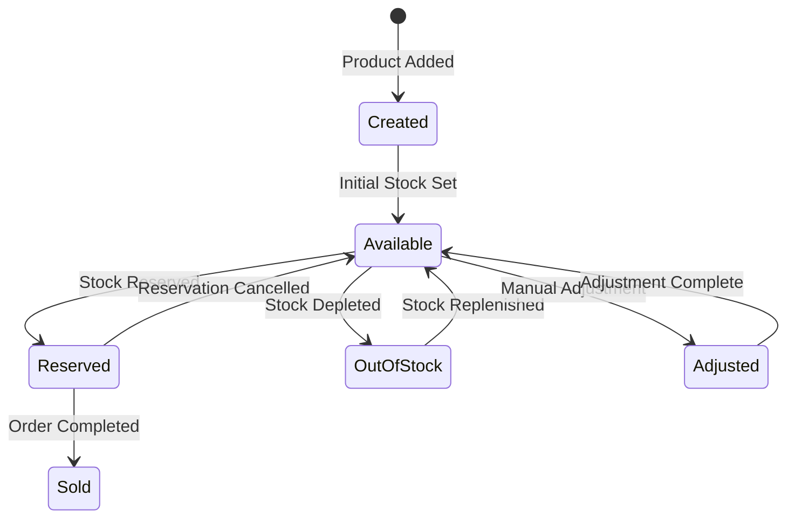

# Inventory Service Documentation

## Overview
The Inventory Service manages product stock levels, handles inventory reservations for orders, and processes inventory adjustments. It uses a Vertical Slice Architecture pattern with PostgreSQL for data persistence.

**Technology Stack**: .NET 10.0 | PostgreSQL | Entity Framework Core | MassTransit | RabbitMQ | Wolverine.net | FluentValidation | Aspire

## Architecture

### High-Level Architecture


### Vertical Slice Architecture


### Stock Reservation Flow


### Inventory Lifecycle


## API Endpoints

### Inventory Management

#### Get All Inventory
- **Endpoint**: `GET /api/inventory`
- **Description**: Get inventory for all products
- **Response**: 
  - `200 OK`: Array of inventory items
- **Authentication**: Required (JWT)

#### Get Inventory by Product ID
- **Endpoint**: `GET /api/inventory/{productId}`
- **Description**: Get inventory for a specific product
- **Path Parameters**:
  - `productId` (Guid): Product ID
- **Response**: 
  - `200 OK`: Inventory details
  - `404 Not Found`: Product not found
- **Authentication**: Required (JWT)

#### Reserve Inventory
- **Endpoint**: `POST /api/inventory/reserve`
- **Description**: Reserve stock for an order
- **Request Body**:
  ```json
  {
    "orderId": "guid",
    "items": [
      {
        "productId": "guid",
        "quantity": 1
      }
    ]
  }
  ```
- **Response**: 
  - `200 OK`: Stock reserved successfully
  - `400 Bad Request`: Insufficient stock
  - `409 Conflict`: Stock already reserved for order
- **Authentication**: Required (JWT)

#### Adjust Inventory
- **Endpoint**: `POST /api/inventory/adjust`
- **Description**: Manually adjust inventory levels
- **Request Body**:
  ```json
  {
    "productId": "guid",
    "quantity": 10,
    "reason": "Replenishment",
    "adjustmentType": "Increase"
  }
  ```
- **Response**: 
  - `200 OK`: Inventory adjusted
  - `400 Bad Request`: Invalid adjustment
  - `404 Not Found`: Product not found
- **Authentication**: Required (JWT)

#### Health Check
- **Endpoint**: `GET /api/inventory/health`
- **Description**: Check service health
- **Response**: 
  - `200 OK`: Service healthy
- **Authentication**: Not required

## Libraries and Packages

### Core Framework
- **.NET 10.0**: Latest .NET runtime
- **ASP.NET Core**: Web API with Minimal APIs

### Database
- **Microsoft.EntityFrameworkCore**: ORM framework
- **Microsoft.EntityFrameworkCore.Design**: Design-time tools
- **Aspire.Npgsql.EntityFrameworkCore.PostgreSQL**: PostgreSQL with Aspire

### CQRS and Validation
- **Wolverine.net**: Command/Query handling (Vertical Slices)
- **FluentValidation**: Request validation
- **FluentValidation.DependencyInjectionExtensions**: DI integration

### Messaging
- **MassTransit**: Message bus abstraction
- **MassTransit.RabbitMQ**: RabbitMQ transport

### API Documentation
- **Scalar.AspNetCore**: Modern API documentation
- **Microsoft.AspNetCore.OpenApi**: OpenAPI support

### Authentication
- **Microsoft.AspNetCore.Authentication.JwtBearer**: JWT authentication

### .NET Aspire
- **Aspire ServiceDefaults**: Service configuration

## Domain Model

### Inventory Entity
```csharp
public class Inventory
{
    public Guid Id { get; set; }
    public Guid ProductId { get; set; }
    public int AvailableStock { get; set; }
    public int ReservedStock { get; set; }
    public int TotalStock { get; set; }
    public DateTime LastUpdated { get; set; }
    public string? LastUpdatedBy { get; set; }
}
```

### Stock Reservation
```csharp
public class StockReservation
{
    public Guid Id { get; set; }
    public Guid OrderId { get; set; }
    public Guid ProductId { get; set; }
    public int Quantity { get; set; }
    public ReservationStatus Status { get; set; }
    public DateTime ReservedAt { get; set; }
    public DateTime? ReleasedAt { get; set; }
}

public enum ReservationStatus
{
    Active,
    Released,
    Fulfilled
}
```

### Inventory Adjustment
```csharp
public class InventoryAdjustment
{
    public Guid Id { get; set; }
    public Guid ProductId { get; set; }
    public int Quantity { get; set; }
    public AdjustmentType Type { get; set; }
    public string Reason { get; set; }
    public DateTime AdjustedAt { get; set; }
    public string AdjustedBy { get; set; }
}

public enum AdjustmentType
{
    Increase,
    Decrease,
    Correction
}
```

## Integration Events

### Published Events
1. **StockReservedEvent**
   ```json
   {
     "orderId": "guid",
     "productId": "guid",
     "quantity": 0,
     "reservedAt": "datetime"
   }
   ```

2. **StockReservationFailedEvent**
   ```json
   {
     "orderId": "guid",
     "productId": "guid",
     "requestedQuantity": 0,
     "availableQuantity": 0,
     "failureReason": "string"
   }
   ```

3. **StockReleasedEvent**
   ```json
   {
     "orderId": "guid",
     "productId": "guid",
     "quantity": 0,
     "releasedAt": "datetime"
   }
   ```

4. **StockLevelChangedEvent**
   ```json
   {
     "productId": "guid",
     "availableStock": 0,
     "reservedStock": 0,
     "totalStock": 0
   }
   ```

### Consumed Events
1. **ProductCreatedEvent**: Initialize inventory for new product
2. **OrderCreatedEvent**: Reserve stock for order
3. **OrderCancelledEvent**: Release reserved stock
4. **OrderCompletedEvent**: Mark reservation as fulfilled

## Vertical Slice Architecture

### Feature: Reserve Inventory
**Location**: `Features/Inventory/ReserveInventory.cs`

```csharp
public static class ReserveInventory
{
    public record Command(Guid OrderId, List<ReservationItem> Items) 
        : IRequest<Result>;
    
    public class Validator : AbstractValidator<Command> { }
    
    public class Handler : IRequestHandler<Command, Result> 
    {
        public async Task<Result> Handle(Command request, 
            CancellationToken cancellationToken)
        {
            // Self-contained feature logic
        }
    }
    
    public static void MapEndpoint(IEndpointRouteBuilder app)
    {
        app.MapPost("/api/inventory/reserve", async (Command command, 
            IMessageBus messageBus) => await messageBus.InvokeAsync<Result>(command));
    }
}
```

### Benefits of Vertical Slices
- **Cohesion**: Related code together
- **Independence**: Features don't share code
- **Testability**: Easy to test in isolation
- **Discoverability**: Clear feature boundaries
- **Maintainability**: Changes localized to one file

## Database Schema

### Tables
- **Inventory**: Stock levels per product
- **StockReservations**: Active stock reservations
- **InventoryAdjustments**: Audit trail of adjustments

### Indexes
```sql
CREATE INDEX idx_inventory_product_id ON inventory(product_id);
CREATE INDEX idx_reservations_order_id ON stock_reservations(order_id);
CREATE INDEX idx_reservations_status ON stock_reservations(status);
```

## Configuration

### Connection Strings
```json
{
  "ConnectionStrings": {
    "inventorydb": "Host=localhost;Database=inventorydb;Username=user;Password=pass"
  }
}
```

### Database Migrations
```bash
dotnet ef migrations add InitialCreate
dotnet ef database update
```

## Error Handling

### Inventory Errors
| Error | HTTP Status | Description |
|-------|-------------|-------------|
| Product Not Found | 404 | Product doesn't exist in inventory |
| Insufficient Stock | 400 | Not enough available stock |
| Invalid Quantity | 400 | Quantity must be positive |
| Already Reserved | 409 | Stock already reserved for order |
| Reservation Not Found | 404 | Reservation doesn't exist |

## Concurrency Handling

### Optimistic Concurrency
- Use row versioning in PostgreSQL
- Retry on concurrency conflicts
- Implement exponential backoff

### Race Condition Prevention
```csharp
// Transaction isolation level
using var transaction = await _context.Database
    .BeginTransactionAsync(IsolationLevel.RepeatableRead);
```

## Health Checks
- PostgreSQL connectivity
- RabbitMQ connectivity
- Database migration status
- Service readiness

## Monitoring

### Key Metrics
- Current stock levels
- Reservation success/failure rate
- Average reservation time
- Stock adjustment frequency
- Low stock alerts

### Alerts
- Stock below threshold
- High reservation failure rate
- Database connection issues
- Long-running transactions

## Testing

### Unit Tests
- Feature handlers in isolation
- Validation logic
- Business rules

### Integration Tests
- Database operations with TestContainers
- Full feature slice execution
- Concurrent reservation attempts

## Best Practices

### Stock Management
- ✅ Use database transactions
- ✅ Handle race conditions
- ✅ Implement idempotency
- ✅ Audit all adjustments
- ✅ Set stock thresholds
- ✅ Alert on low stock

### Reservations
- ✅ Time-bound reservations
- ✅ Auto-release expired reservations
- ✅ Track reservation lifecycle
- ✅ Handle partial reservations
- ✅ Implement retry logic

## Development

### Local Development
1. Start PostgreSQL (Docker or local)
2. Run migrations: `dotnet ef database update`
3. Configure connection string
4. Run: `dotnet run`
5. Access API docs: `http://localhost:<port>/scalar/v1`

### Seeding Data
```csharp
// Seed initial inventory
await _context.Inventory.AddRangeAsync(
    new Inventory { ProductId = productId, TotalStock = 100 }
);
```

## Future Enhancements
- [ ] Multi-location inventory
- [ ] Batch reservations
- [ ] Stock forecasting
- [ ] Automatic reorder points
- [ ] Warehouse management
- [ ] Barcode scanning integration
- [ ] Inventory analytics dashboard
