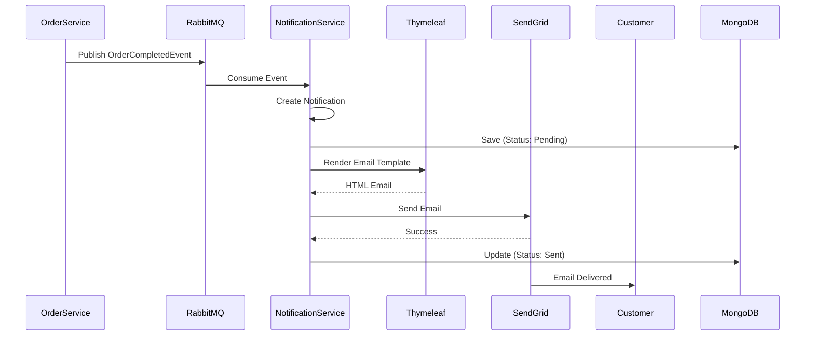

# Notification Service Documentation

## Overview
The Notification Service handles all notification delivery in the microservices architecture. Implemented in Java with Spring Boot, it demonstrates polyglot microservices by consuming events from RabbitMQ and sending notifications via email (SendGrid) and potentially SMS.

**Technology Stack**: Java 21 | Spring Boot 3.2 | MongoDB | RabbitMQ | SendGrid | Thymeleaf

## Architecture

### High-Level Architecture


### Notification Flow


### Notification Types


### Component Architecture


## API Endpoints

### Notification Management

#### Get User Notifications
- **Endpoint**: `GET /api/notifications/user/{userId}`
- **Description**: Get all notifications for a specific user
- **Path Parameters**:
  - `userId` (UUID): User ID
- **Response**: 
  - `200 OK`: Array of notifications
- **Authentication**: Required (JWT)

#### Get Order Notifications
- **Endpoint**: `GET /api/notifications/order/{orderId}`
- **Description**: Get notifications related to a specific order
- **Path Parameters**:
  - `orderId` (UUID): Order ID
- **Response**: 
  - `200 OK`: Array of notifications
- **Authentication**: Required (JWT)

#### Get All Notifications
- **Endpoint**: `GET /api/notifications`
- **Description**: Get all notifications (paginated)
- **Query Parameters**:
  - `page` (int, default: 0): Page number
  - `size` (int, default: 20): Page size
  - `status` (string, optional): Filter by status
  - `type` (string, optional): Filter by type
- **Response**: 
  - `200 OK`: Paginated notifications
- **Authentication**: Required (JWT)

#### Health Check
- **Endpoint**: `GET /actuator/health`
- **Description**: Spring Boot Actuator health check
- **Response**: 
  - `200 OK`: Service health status
- **Authentication**: Not required

## Libraries and Dependencies

### Core Framework
- **Java 21**: Latest LTS Java version
- **Spring Boot 3.2.0**: Application framework
  - **spring-boot-starter-web**: REST API
  - **spring-boot-starter-validation**: Input validation
  - **spring-boot-starter-actuator**: Health checks and metrics

### Messaging
- **spring-boot-starter-amqp**: RabbitMQ integration
- **Spring AMQP**: Message consumption and routing

### Database
- **spring-boot-starter-data-mongodb**: MongoDB integration
- **MongoDB Java Driver**: Official MongoDB driver

### Email
- **SendGrid Java SDK**: Email delivery service
- **Spring Boot Mail**: Email abstraction

### Templating
- **Thymeleaf**: Template engine for email HTML
- **thymeleaf-spring6**: Spring integration

### Utilities
- **Lombok**: Reduce boilerplate code
- **Jackson**: JSON serialization

### Testing
- **JUnit 5**: Unit testing
- **Mockito**: Mocking framework
- **Spring Boot Test**: Integration testing
- **Testcontainers**: MongoDB test containers

## Domain Model

### Notification Entity
```java
@Document(collection = "notifications")
public class Notification {
    @Id
    private String id;
    private String userId;
    private String email;
    private NotificationType type;
    private String subject;
    private String body;
    private NotificationStatus status;
    private Map<String, Object> metadata;
    private LocalDateTime createdAt;
    private LocalDateTime sentAt;
    private String errorMessage;
    private int retryCount;
}
```

### Notification Type
```java
public enum NotificationType {
    ORDER_CREATED,
    ORDER_COMPLETED,
    ORDER_CANCELLED,
    PAYMENT_PROCESSED,
    PAYMENT_FAILED,
    ACCOUNT_CREATED,
    PASSWORD_RESET,
    SHIPPING_UPDATE
}
```

### Notification Status
```java
public enum NotificationStatus {
    PENDING,
    SENT,
    FAILED,
    RETRYING
}
```

## Integration Events

### Consumed Events
1. **OrderCreatedEvent**
   - Sends order confirmation email
   - Template: `order-confirmation.html`

2. **OrderCompletedEvent**
   - Sends order completion notification
   - Template: `order-completed.html`

3. **OrderCancelledEvent**
   - Sends cancellation notification
   - Template: `order-cancelled.html`

4. **PaymentProcessedEvent**
   - Sends payment receipt
   - Template: `payment-receipt.html`

5. **PaymentFailedEvent**
   - Notifies payment failure
   - Template: `payment-failed.html`

6. **UserRegisteredEvent**
   - Sends welcome email
   - Template: `welcome.html`

### Published Events
- None (Notification Service is a terminal service)

## Email Templates

### Template Structure
```html
<!DOCTYPE html>
<html xmlns:th="http://www.thymeleaf.org">
<head>
    <title th:text="${subject}">Email Subject</title>
</head>
<body>
    <div class="container">
        <h1 th:text="${title}">Title</h1>
        <p th:text="${message}">Message content</p>
        
        <!-- Dynamic content -->
        <div th:if="${orderDetails}">
            <h2>Order Details</h2>
            <p>Order ID: <span th:text="${orderDetails.id}"></span></p>
            <p>Total: <span th:text="${orderDetails.total}"></span></p>
        </div>
    </div>
</body>
</html>
```

### Available Templates
- `welcome.html`: Welcome new users
- `order-confirmation.html`: Order placed confirmation
- `order-completed.html`: Order fulfillment notification
- `order-cancelled.html`: Cancellation notification
- `payment-receipt.html`: Payment confirmation
- `payment-failed.html`: Payment failure alert
- `shipping-update.html`: Shipping status updates

## Configuration

### Application Properties
```yaml
spring:
  application:
    name: notification-service
  
  data:
    mongodb:
      uri: mongodb://localhost:27017/notificationdb
      database: notificationdb
  
  rabbitmq:
    host: localhost
    port: 5672
    username: guest
    password: guest
    
  mail:
    sendgrid:
      api-key: ${SENDGRID_API_KEY}
      from-email: noreply@productordering.com
      from-name: Product Ordering System

server:
  port: 8080

notification:
  retry:
    max-attempts: 3
    delay-ms: 5000
  templates:
    path: classpath:/templates/email/
```

### Environment Variables
- `SENDGRID_API_KEY`: SendGrid API key
- `MONGODB_URI`: MongoDB connection string
- `RABBITMQ_HOST`: RabbitMQ host
- `RABBITMQ_PORT`: RabbitMQ port

## Message Consumers

### RabbitMQ Configuration
```java
@Configuration
public class RabbitMQConfig {
    
    @Bean
    public Queue orderNotificationQueue() {
        return new Queue("order.notifications", true);
    }
    
    @Bean
    public Queue paymentNotificationQueue() {
        return new Queue("payment.notifications", true);
    }
    
    @Bean
    public Jackson2JsonMessageConverter messageConverter() {
        return new Jackson2JsonMessageConverter();
    }
}
```

### Event Consumer Example
```java
@Component
public class OrderEventConsumer {
    
    @RabbitListener(queues = "order.notifications")
    public void handleOrderCreated(OrderCreatedEvent event) {
        notificationService.sendOrderConfirmation(event);
    }
    
    @RabbitListener(queues = "order.notifications")
    public void handleOrderCompleted(OrderCompletedEvent event) {
        notificationService.sendOrderCompletion(event);
    }
}
```

## Error Handling

### Notification Errors
| Error | Handling Strategy |
|-------|------------------|
| SendGrid API Error | Retry with exponential backoff |
| Invalid Email Address | Mark as failed, no retry |
| Template Not Found | Log error, use fallback template |
| RabbitMQ Connection Lost | Spring AMQP auto-recovery |
| MongoDB Connection Lost | Retry operation |

### Retry Logic
```java
@Retryable(
    value = {SendGridException.class},
    maxAttempts = 3,
    backoff = @Backoff(delay = 5000, multiplier = 2)
)
public void sendEmail(Notification notification) {
    // Send email logic
}
```

## Health Checks

### Spring Boot Actuator
- `/actuator/health`: Overall health
- `/actuator/health/mongodb`: MongoDB status
- `/actuator/health/rabbitmq`: RabbitMQ status
- `/actuator/metrics`: Application metrics

### Custom Health Indicators
```java
@Component
public class SendGridHealthIndicator implements HealthIndicator {
    @Override
    public Health health() {
        // Check SendGrid API connectivity
    }
}
```

## Monitoring

### Key Metrics
- Notifications sent per minute
- Email delivery success rate
- Average email send time
- Failed notifications
- Retry attempts
- Queue depth

### Logging
```java
@Slf4j
public class NotificationService {
    public void sendNotification(Notification notification) {
        log.info("Sending notification {} to {}", 
            notification.getType(), notification.getEmail());
        
        try {
            emailService.send(notification);
            log.info("Notification {} sent successfully", 
                notification.getId());
        } catch (Exception e) {
            log.error("Failed to send notification {}: {}", 
                notification.getId(), e.getMessage());
        }
    }
}
```

## Testing

### Unit Tests
```java
@SpringBootTest
class NotificationServiceTest {
    
    @MockBean
    private EmailService emailService;
    
    @Test
    void shouldSendOrderConfirmation() {
        // Test logic
    }
}
```

### Integration Tests with Testcontainers
```java
@Testcontainers
class NotificationIntegrationTest {
    
    @Container
    static MongoDBContainer mongoContainer = 
        new MongoDBContainer("mongo:7.0");
    
    @Test
    void shouldPersistNotification() {
        // Test logic
    }
}
```

## Best Practices

### Email Delivery
- ✅ Use email templates for consistency
- ✅ Implement retry logic
- ✅ Track delivery status
- ✅ Validate email addresses
- ✅ Handle bounces and complaints
- ✅ Respect unsubscribe requests

### Performance
- ✅ Async notification processing
- ✅ Batch email sends when possible
- ✅ Use connection pooling
- ✅ Cache templates
- ✅ Monitor queue depths

### Security
- ✅ Secure API keys (use secrets management)
- ✅ Validate input data
- ✅ Sanitize template data
- ✅ Use TLS for email transmission
- ✅ Log security events

## Development

### Running Locally
```bash
# Set environment variables
export SENDGRID_API_KEY=your-api-key

# Run with Maven
./mvnw spring-boot:run

# Or with packaged JAR
./mvnw clean package
java -jar target/notification-service-1.0.0.jar
```

### Docker
```dockerfile
FROM eclipse-temurin:21-jre-alpine
COPY target/notification-service-1.0.0.jar app.jar
ENTRYPOINT ["java", "-jar", "/app.jar"]
```

## Polyglot Integration

### Why Java for Notifications?
- **Rich email libraries**: SendGrid, JavaMail
- **Mature templating**: Thymeleaf, FreeMarker
- **Spring ecosystem**: Robust, production-ready
- **Team expertise**: Leverage Java skills

### Interoperability
- **Protocol-based**: RabbitMQ AMQP (language-agnostic)
- **JSON messaging**: Universal data format
- **REST APIs**: Standard HTTP/JSON
- **Shared contracts**: Event schemas

## Future Enhancements
- [ ] SMS notifications (Twilio)
- [ ] Push notifications
- [ ] In-app notifications
- [ ] Notification preferences per user
- [ ] A/B testing for email templates
- [ ] Scheduled notifications
- [ ] Notification analytics
- [ ] Multi-language support
- [ ] Rich media attachments
- [ ] Webhook notifications
