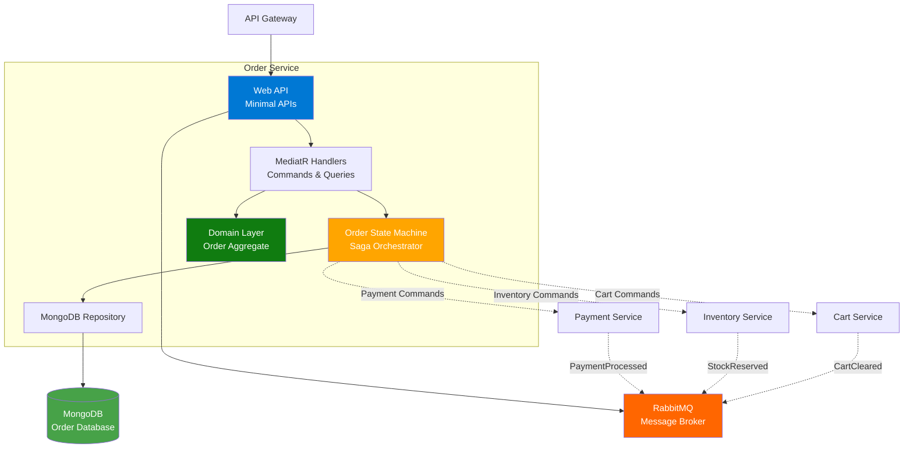
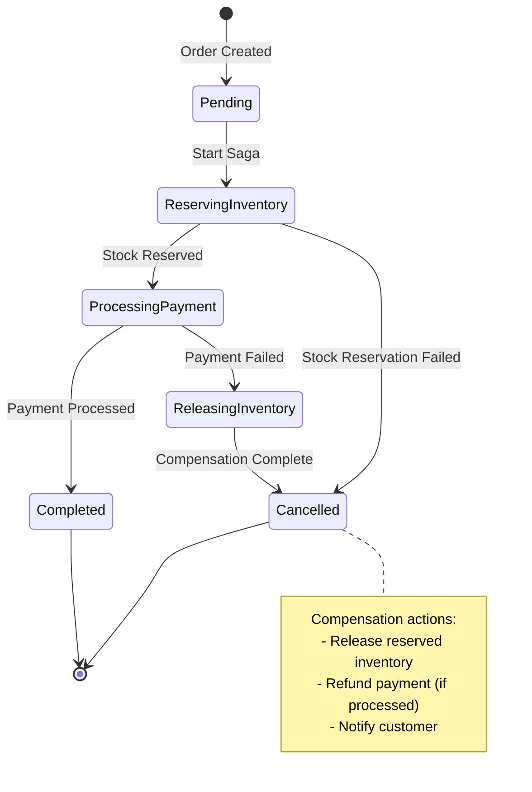
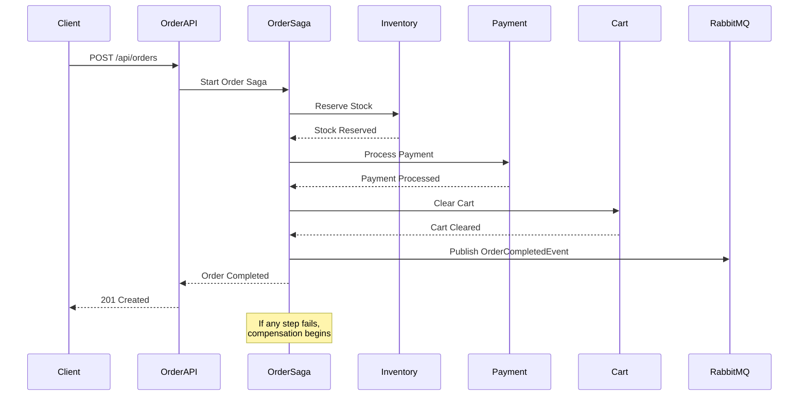
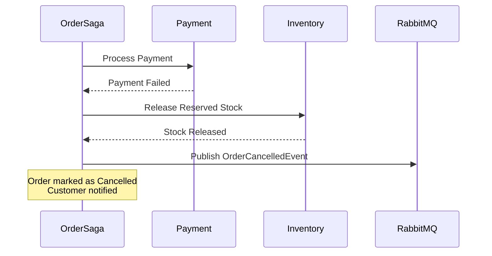

# Order Service Documentation

## Overview
The Order Service is the core orchestrator for order processing in the microservices architecture. It implements the Saga pattern to coordinate distributed transactions across multiple services (Payment, Inventory, Cart) and handles the entire order lifecycle.

**Technology Stack**: .NET 10.0 | MongoDB | MassTransit | RabbitMQ | MediatR | Saga Pattern

## Architecture

### High-Level Architecture


### Saga State Machine


### Order Lifecycle


### Compensation Flow


## API Endpoints

### Order Management

#### Create Order
- **Endpoint**: `POST /api/orders`
- **Description**: Create a new order and initiate the order saga
- **Request Body**:
  ```json
  {
    "customerId": "guid",
    "shippingAddress": {
      "street": "string",
      "city": "string",
      "state": "string",
      "postalCode": "string",
      "country": "string"
    },
    "items": [
      {
        "productId": "guid",
        "productName": "string",
        "quantity": 1,
        "price": 0.00
      }
    ]
  }
  ```
- **Response**: 
  - `201 Created`: Order created with Location header
  - `400 Bad Request`: Validation errors
  - `409 Conflict`: Order already exists
- **Authentication**: Required (JWT)

#### Get Order by ID
- **Endpoint**: `GET /api/orders/{id}`
- **Description**: Retrieve a specific order by ID
- **Path Parameters**:
  - `id` (Guid): Order ID
- **Response**: 
  - `200 OK`: Order details with status
  - `404 Not Found`: Order not found
- **Authentication**: Required (JWT)

#### Get Orders
- **Endpoint**: `GET /api/orders`
- **Description**: Get all orders for the authenticated user
- **Query Parameters**:
  - `customerId` (Guid, optional): Filter by customer
  - `status` (string, optional): Filter by status
  - `page` (int, default: 1): Page number
  - `pageSize` (int, default: 10): Items per page
- **Response**: 
  - `200 OK`: Array of orders
- **Authentication**: Required (JWT)

## Libraries and Packages

### Core Framework
- **.NET 10.0**: Latest .NET runtime
- **ASP.NET Core**: Web API with Minimal APIs

### CQRS and Messaging
- **MediatR**: Command/Query handling
- **MassTransit**: Message bus and saga orchestration
- **MassTransit.RabbitMQ**: RabbitMQ transport

### Database
- **MongoDB.Driver**: Official MongoDB driver
- **Aspire.MongoDB.Driver**: .NET Aspire MongoDB integration

### Error Handling
- **ErrorOr**: Functional error handling pattern

### API Documentation
- **Scalar.AspNetCore**: Modern API documentation
- **Microsoft.AspNetCore.OpenApi**: OpenAPI support

### Authentication
- **Microsoft.AspNetCore.Authentication.JwtBearer**: JWT authentication
- **Microsoft.IdentityModel.Tokens**: Token validation

### .NET Aspire
- **Aspire ServiceDefaults**: Service configuration

## Domain Model

### Order Aggregate
```csharp
public class Order
{
    public Guid Id { get; }
    public Guid CustomerId { get; }
    public OrderStatus Status { get; }
    public List<OrderItem> Items { get; }
    public ShippingAddress ShippingAddress { get; }
    public decimal TotalAmount { get; }
    public DateTime CreatedAt { get; }
    public DateTime? CompletedAt { get; }
    public string? CancellationReason { get; }
}
```

### Order Status Enum
```csharp
public enum OrderStatus
{
    Pending,
    ReservingInventory,
    ProcessingPayment,
    Completed,
    Cancelled,
    Failed
}
```

### Order Item
```csharp
public class OrderItem
{
    public Guid ProductId { get; }
    public string ProductName { get; }
    public int Quantity { get; }
    public decimal Price { get; }
    public decimal Subtotal { get; }
}
```

## Saga Implementation

### Order State Machine
- **State**: Order status tracking
- **Data**: Order saga data (order ID, customer ID, amounts)
- **Events**: Integration events from dependent services

### Saga Activities
1. **ReserveInventory**: Reserve stock for order items
2. **ProcessPayment**: Process payment for total amount
3. **ClearCart**: Clear customer's cart after successful order
4. **PublishOrderCompleted**: Notify other services of completion

### Compensation Activities
1. **ReleaseInventory**: Release reserved stock
2. **RefundPayment**: Refund processed payment
3. **PublishOrderCancelled**: Notify services of cancellation

## Integration Events

### Published Events
1. **OrderCreatedEvent**: Order initiated
   ```json
   {
     "orderId": "guid",
     "customerId": "guid",
     "items": [],
     "totalAmount": 0.00,
     "createdAt": "datetime"
   }
   ```

2. **OrderCompletedEvent**: Order successfully completed
   ```json
   {
     "orderId": "guid",
     "customerId": "guid",
     "completedAt": "datetime"
   }
   ```

3. **OrderCancelledEvent**: Order cancelled (compensation)
   ```json
   {
     "orderId": "guid",
     "customerId": "guid",
     "reason": "string",
     "cancelledAt": "datetime"
   }
   ```

4. **OrderFailedEvent**: Order failed
   ```json
   {
     "orderId": "guid",
     "reason": "string",
     "failedAt": "datetime"
   }
   ```

### Consumed Events
1. **StockReservedEvent**: Inventory successfully reserved
2. **StockReservationFailedEvent**: Inventory reservation failed
3. **PaymentProcessedEvent**: Payment successfully processed
4. **PaymentFailedEvent**: Payment processing failed

## Configuration

### Connection Strings
- **orderdb**: MongoDB connection (via Aspire)
- **messaging**: RabbitMQ connection (via Aspire)

### Saga Configuration
```json
{
  "Saga": {
    "TimeoutMinutes": 5,
    "MaxRetries": 3,
    "RetryDelay": "00:00:30"
  }
}
```

### JWT Configuration
```json
{
  "Jwt": {
    "SecretKey": "your-secret-key",
    "Issuer": "your-issuer",
    "Audience": "your-audience"
  }
}
```

## Error Handling

### Saga Compensation Scenarios
| Failure Point | Compensation Actions |
|---------------|---------------------|
| Stock Reservation Failed | Cancel order, notify customer |
| Payment Failed | Release inventory, cancel order |
| Payment Processed but Saga Failed | Refund payment, release inventory |

### HTTP Errors
| Error | HTTP Status | Description |
|-------|-------------|-------------|
| Order Not Found | 404 | Order ID doesn't exist |
| Invalid Items | 400 | Missing or invalid order items |
| Insufficient Stock | 409 | Not enough inventory |
| Payment Failed | 402 | Payment processing failed |

## Health Checks
- MongoDB connectivity
- RabbitMQ connectivity
- Saga state machine health
- Service dependencies health

## Observability

### Saga Monitoring
- Track saga state transitions
- Monitor compensation executions
- Alert on failed compensations

### Distributed Tracing
- OpenTelemetry integration
- Full saga trace across services
- Performance metrics per saga step

## Development

### Local Development
1. Ensure MongoDB and RabbitMQ are running
2. Start dependent services (Inventory, Payment, Cart)
3. Configure connection strings
4. Run: `dotnet run`
5. Access API docs: `http://localhost:<port>/scalar/v1`

### Testing
- Unit tests for domain logic
- Saga state machine tests
- Integration tests with dependent services
- Compensation flow testing
- End-to-end order workflow tests

## Best Practices

### Saga Design
- Keep saga steps idempotent
- Always implement compensation actions
- Set appropriate timeouts
- Log all state transitions
- Handle partial failures gracefully

### Order Processing
- Validate order before starting saga
- Check inventory availability early
- Capture payment authorization first
- Implement retry logic for transient failures
- Send customer notifications at key stages
