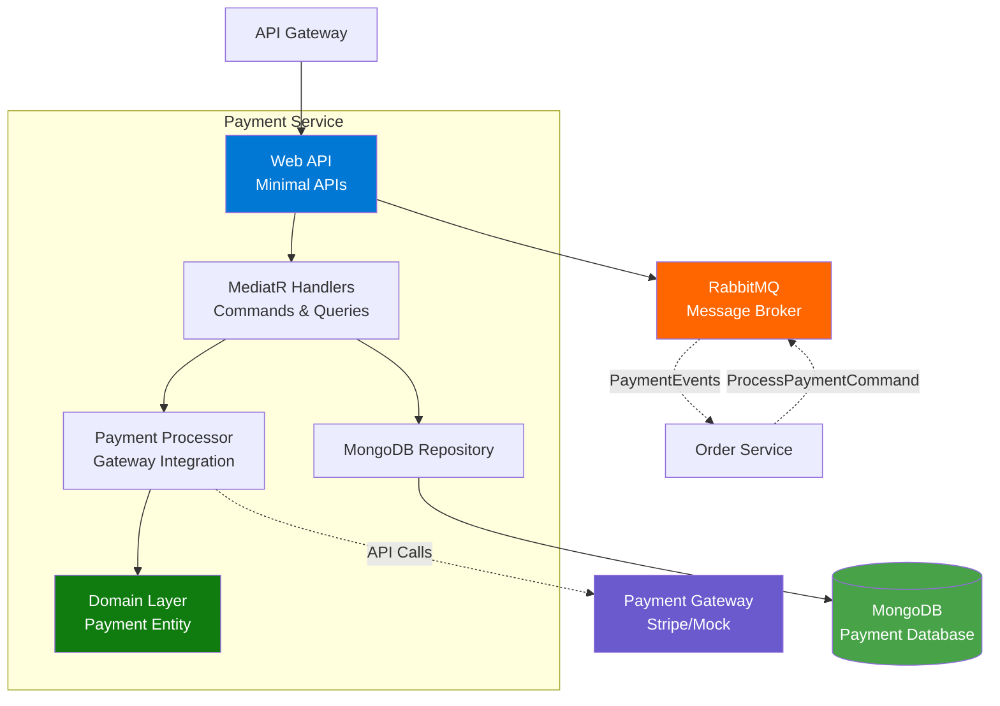
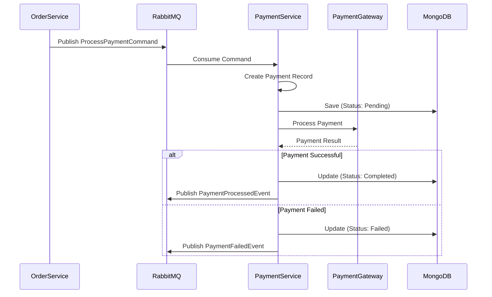
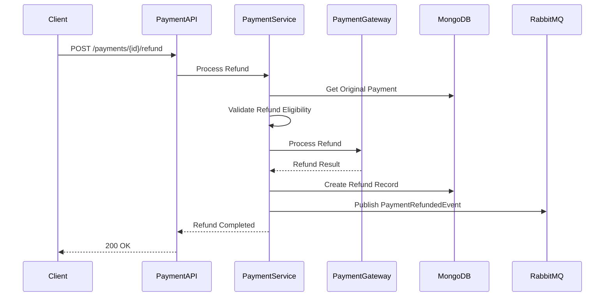
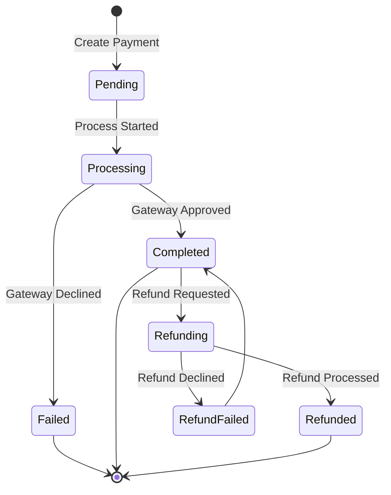

# Payment Service Documentation

## Overview
The Payment Service handles payment processing, refunds, and payment transaction management. It integrates with external payment gateways and participates in the order saga pattern for distributed transaction coordination.

**Technology Stack**: .NET 10.0 | MongoDB | MassTransit | RabbitMQ | MediatR | Stripe API (Mock)

## Architecture

### High-Level Architecture


### Payment Flow


### Refund Flow


### Payment State Machine


## API Endpoints

### Payment Management

#### Get Payment by ID
- **Endpoint**: `GET /api/payments/{id}`
- **Description**: Retrieve payment details by ID
- **Path Parameters**:
  - `id` (Guid): Payment ID
- **Response**: 
  - `200 OK`: Payment details
  - `404 Not Found`: Payment not found
- **Authentication**: Required (JWT)

#### Get Payment by Order ID
- **Endpoint**: `GET /api/payments/order/{orderId}`
- **Description**: Get payment for a specific order
- **Path Parameters**:
  - `orderId` (Guid): Order ID
- **Response**: 
  - `200 OK`: Payment details
  - `404 Not Found`: No payment for order
- **Authentication**: Required (JWT)

#### Process Payment (Manual)
- **Endpoint**: `POST /api/payments/process`
- **Description**: Manually process a payment (typically called via messaging)
- **Request Body**:
  ```json
  {
    "orderId": "guid",
    "customerId": "guid",
    "amount": 0.00,
    "currency": "USD",
    "paymentMethod": {
      "type": "CreditCard",
      "cardNumber": "4111111111111111",
      "expiryMonth": 12,
      "expiryYear": 2025,
      "cvv": "123"
    }
  }
  ```
- **Response**: 
  - `200 OK`: Payment processed
  - `402 Payment Required`: Payment failed
  - `400 Bad Request`: Invalid payment method
- **Authentication**: Required (JWT)

#### Refund Payment
- **Endpoint**: `POST /api/payments/{id}/refund`
- **Description**: Refund a completed payment
- **Path Parameters**:
  - `id` (Guid): Payment ID
- **Request Body**:
  ```json
  {
    "amount": 0.00,
    "reason": "Customer request"
  }
  ```
- **Response**: 
  - `200 OK`: Refund processed
  - `400 Bad Request`: Invalid refund request
  - `404 Not Found`: Payment not found
- **Authentication**: Required (JWT)

## Libraries and Packages

### Core Framework
- **.NET 10.0**: Latest .NET runtime
- **ASP.NET Core**: Web API with Minimal APIs

### CQRS and Messaging
- **MediatR**: Command/Query handling
- **MassTransit**: Message bus abstraction
- **MassTransit.RabbitMQ**: RabbitMQ transport

### Database
- **MongoDB.Driver**: Official MongoDB driver
- **Aspire.MongoDB.Driver**: .NET Aspire MongoDB integration

### API Documentation
- **Scalar.AspNetCore**: Modern API documentation
- **Microsoft.AspNetCore.OpenApi**: OpenAPI support

### Authentication
- **Microsoft.AspNetCore.Authentication.JwtBearer**: JWT authentication

### Payment Gateway
- **Stripe.net** (or Mock Implementation): Payment processing

### .NET Aspire
- **Aspire ServiceDefaults**: Service configuration

## Domain Model

### Payment Entity
```csharp
public class Payment
{
    public Guid Id { get; }
    public Guid OrderId { get; }
    public Guid CustomerId { get; }
    public decimal Amount { get; }
    public string Currency { get; }
    public PaymentStatus Status { get; }
    public PaymentMethod PaymentMethod { get; }
    public string? GatewayTransactionId { get; }
    public DateTime CreatedAt { get; }
    public DateTime? ProcessedAt { get; }
    public string? FailureReason { get; }
}
```

### Payment Status
```csharp
public enum PaymentStatus
{
    Pending,
    Processing,
    Completed,
    Failed,
    Refunding,
    Refunded,
    RefundFailed
}
```

### Payment Method
```csharp
public class PaymentMethod
{
    public PaymentMethodType Type { get; }
    public string Last4Digits { get; }
    public string CardBrand { get; }
    public int ExpiryMonth { get; }
    public int ExpiryYear { get; }
}

public enum PaymentMethodType
{
    CreditCard,
    DebitCard,
    PayPal,
    BankTransfer
}
```

### Refund Entity
```csharp
public class Refund
{
    public Guid Id { get; }
    public Guid PaymentId { get; }
    public decimal Amount { get; }
    public string Reason { get; }
    public RefundStatus Status { get; }
    public DateTime CreatedAt { get; }
    public DateTime? ProcessedAt { get; }
}
```

## Integration Events

### Published Events
1. **PaymentProcessedEvent**
   ```json
   {
     "paymentId": "guid",
     "orderId": "guid",
     "amount": 0.00,
     "currency": "USD",
     "gatewayTransactionId": "string",
     "processedAt": "datetime"
   }
   ```

2. **PaymentFailedEvent**
   ```json
   {
     "paymentId": "guid",
     "orderId": "guid",
     "amount": 0.00,
     "failureReason": "string",
     "failedAt": "datetime"
   }
   ```

3. **PaymentRefundedEvent**
   ```json
   {
     "refundId": "guid",
     "paymentId": "guid",
     "orderId": "guid",
     "amount": 0.00,
     "refundedAt": "datetime"
   }
   ```

### Consumed Events
1. **ProcessPaymentCommand**: From Order Service saga
2. **RefundPaymentCommand**: From Order Service compensation

## Payment Gateway Integration

### Mock Implementation
For development and testing, a mock payment gateway is used:

```csharp
public class MockPaymentGateway : IPaymentGateway
{
    public Task<PaymentResult> ProcessPaymentAsync(PaymentRequest request)
    {
        // Simulate payment processing
        // Test cards: 4111111111111111 = success
        //            4000000000000002 = decline
    }
    
    public Task<RefundResult> ProcessRefundAsync(RefundRequest request)
    {
        // Simulate refund processing
    }
}
```

### Production Integration
Replace mock with actual gateway (e.g., Stripe):
- API key configuration
- Webhook setup for async notifications
- PCI compliance requirements
- Error handling and retry logic

## Configuration

### Connection Strings
```json
{
  "ConnectionStrings": {
    "paymentdb": "mongodb://localhost:27017/paymentdb",
    "messaging": "amqp://localhost:5672"
  }
}
```

### Payment Gateway
```json
{
  "PaymentGateway": {
    "Provider": "Stripe",
    "ApiKey": "sk_test_...",
    "WebhookSecret": "whsec_...",
    "Currency": "USD"
  }
}
```

### User Secrets (Development)
```bash
dotnet user-secrets set "PaymentGateway:ApiKey" "your-api-key"
```

## Error Handling

### Payment Errors
| Error | HTTP Status | Description |
|-------|-------------|-------------|
| Payment Not Found | 404 | Payment ID doesn't exist |
| Payment Already Processed | 409 | Cannot reprocess completed payment |
| Insufficient Funds | 402 | Card declined - insufficient funds |
| Invalid Card | 400 | Card number invalid |
| Gateway Error | 502 | Payment gateway unavailable |
| Refund Not Allowed | 400 | Payment not refundable |
| Partial Refund Exceeded | 400 | Refund amount exceeds original |

## Security

### PCI Compliance
- **Never store CVV**: Only pass to gateway
- **Tokenization**: Store tokens, not card numbers
- **Encryption**: Encrypt sensitive data at rest
- **TLS**: Always use HTTPS
- **Logging**: Never log full card numbers

### Fraud Prevention
- Address verification (AVS)
- CVV verification
- 3D Secure support
- Velocity checks
- IP geolocation matching

## Health Checks
- MongoDB connectivity
- RabbitMQ connectivity
- Payment gateway availability
- Service readiness

## Monitoring

### Key Metrics
- Payment success rate
- Payment processing time
- Failed payment reasons
- Refund rate
- Gateway response times
- Fraud detection triggers

### Alerts
- High failure rate
- Gateway downtime
- Unusual refund activity
- Processing delays

## Testing

### Test Cards (Mock Gateway)
- **Success**: 4111111111111111
- **Declined**: 4000000000000002
- **Insufficient Funds**: 4000000000009995
- **Expired Card**: Any card with past expiry

### Integration Tests
- Successful payment flow
- Failed payment handling
- Refund processing
- Idempotency checks
- Concurrent payment attempts

## Best Practices

### Payment Processing
- ✅ Implement idempotency
- ✅ Use retry with exponential backoff
- ✅ Log all transactions
- ✅ Validate amounts before processing
- ✅ Handle all gateway error codes
- ✅ Implement timeout handling

### Refunds
- ✅ Validate refund eligibility
- ✅ Support partial refunds
- ✅ Track refund reasons
- ✅ Notify customers
- ✅ Update order status

### Security
- ✅ PCI DSS compliance
- ✅ Encrypt sensitive data
- ✅ Use payment tokenization
- ✅ Implement rate limiting
- ✅ Monitor for fraud

## Development

### Local Development
1. Configure MongoDB connection
2. Set up mock payment gateway
3. Configure RabbitMQ
4. Run: `dotnet run`
5. Access API docs: `http://localhost:<port>/scalar/v1`

### Testing Webhooks
```bash
stripe listen --forward-to localhost:<port>/webhooks/stripe
```

## Future Enhancements
- [ ] Support multiple payment gateways
- [ ] Implement payment retries
- [ ] Add saved payment methods
- [ ] Subscription/recurring payments
- [ ] Split payments
- [ ] Multi-currency support
- [ ] Advanced fraud detection
- [ ] Payment analytics dashboard
