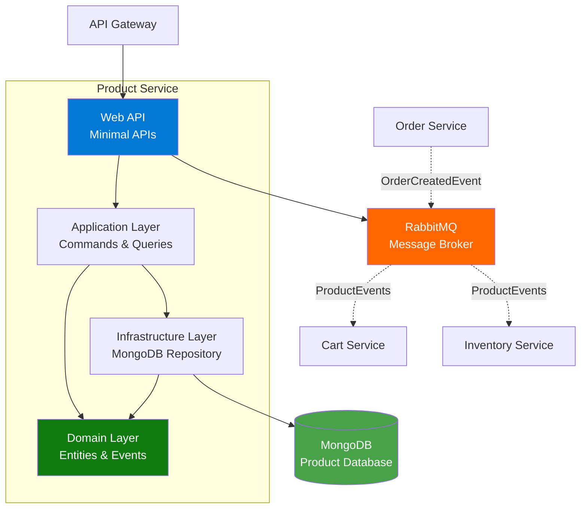
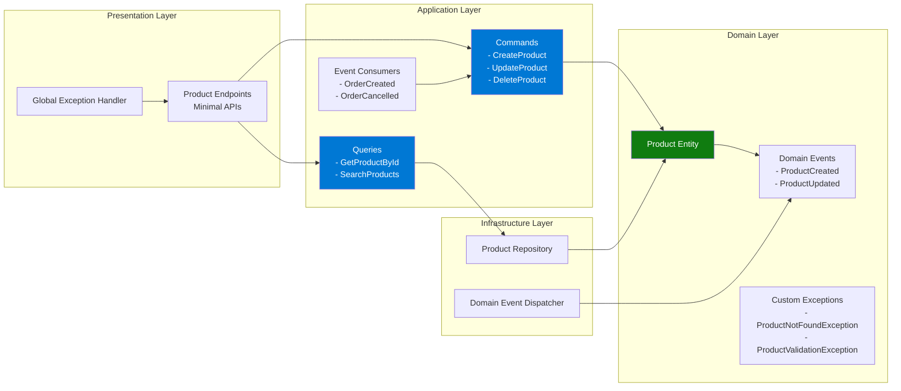
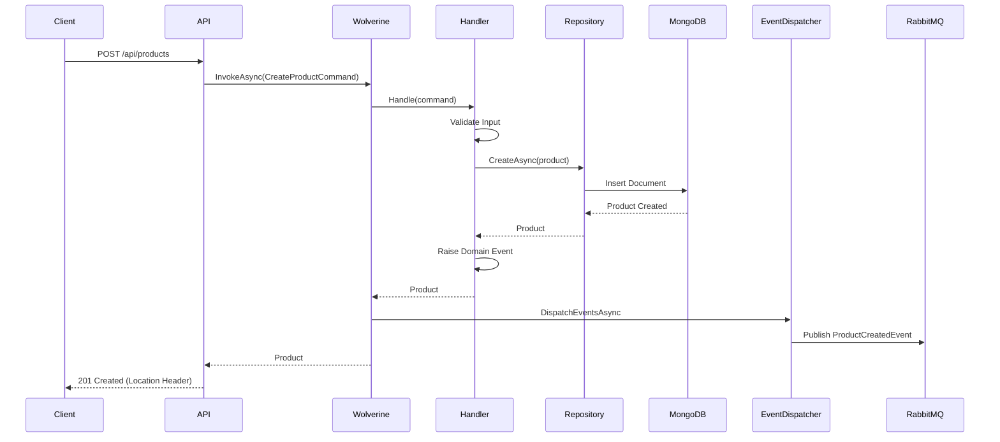

# Product Service Documentation

## Overview
The Product Service is responsible for managing the product catalog in the microservices architecture. It handles product creation, updates, inventory tracking, and provides product information to other services.

**Technology Stack**: .NET 10.0 | MongoDB | Wolverine.NET | RabbitMQ | OpenTelemetry | Aspire

## Architecture

### High-Level Architecture


### Component Architecture


### Message Flow


## API Endpoints

### Product Management

#### Search Products
- **Endpoint**: `GET /api/products`
- **Description**: Search products with optional filters and pagination
- **Query Parameters**:
  - `searchTerm` (string, optional): Text search in name/description
  - `category` (string, optional): Filter by category
  - `minPrice` (decimal, optional): Minimum price filter
  - `maxPrice` (decimal, optional): Maximum price filter
  - `page` (int, default: 1): Page number
  - `pageSize` (int, default: 10): Items per page
- **Response**: 
  - `200 OK`: Array of products
  - Custom header `X-Pagination`: Pagination metadata (JSON)
- **Authentication**: Not required

#### Get Product by ID
- **Endpoint**: `GET /api/products/{id}`
- **Description**: Retrieve a specific product by ID
- **Path Parameters**:
  - `id` (string): Product ID
- **Response**: 
  - `200 OK`: Product details
  - `404 Not Found`: Product not found
- **Authentication**: Not required

#### Create Product
- **Endpoint**: `POST /api/products`
- **Description**: Create a new product
- **Request Body**:
  ```json
  {
    "name": "string",
    "description": "string",
    "price": 0.00,
    "stockQuantity": 0,
    "category": "string",
    "imageUrl": "string"
  }
  ```
- **Response**: 
  - `201 Created`: Location header with product URL
  - `400 Bad Request`: Validation errors
- **Authentication**: Required (JWT)

#### Update Product
- **Endpoint**: `PUT /api/products/{id}`
- **Description**: Update an existing product
- **Path Parameters**:
  - `id` (string): Product ID
- **Request Body**: Same as Create Product
- **Response**: 
  - `200 OK`: Updated product details
  - `400 Bad Request`: Validation errors
  - `404 Not Found`: Product not found
- **Authentication**: Required (JWT)

#### Delete Product
- **Endpoint**: `DELETE /api/products/{id}`
- **Description**: Delete a product
- **Path Parameters**:
  - `id` (string): Product ID
- **Response**: 
  - `204 No Content`: Successfully deleted
  - `404 Not Found`: Product not found
- **Authentication**: Required (JWT)

#### Sync Product Cache
- **Endpoint**: `POST /api/products/sync-cache`
- **Description**: Republish events for all products to populate consumer caches
- **Response**: 
  - `200 OK`: Sync completion summary
- **Authentication**: Not required

## Libraries and Packages

### Core Framework
- **.NET 10.0**: Latest .NET runtime and framework
- **ASP.NET Core**: Web API framework with Minimal APIs

### Messaging and CQRS (Wolverine.NET)
- **Wolverine** (v4.4.0): Next-generation messaging and CQRS framework
  - Unified command/query handling
  - Message bus for in-process and distributed messaging
  - Built-in validation and error handling
  - Transactional outbox pattern
  - Saga orchestration capabilities
- **Wolverine.RabbitMQ** (v4.4.0): RabbitMQ transport integration
  - Auto-provisioning of exchanges and queues
  - Event publishing to RabbitMQ
  - Message consumption from queues
  - Routing and filtering
- **Wolverine.Http** (v4.4.0): HTTP integration features
  - Endpoint generation
  - Request/response handling

**Why Wolverine?**
- Modern alternative to MassTransit/MediatR
- Better performance with source generation
- Simplified configuration
- Native async/await support
- Automatic retry and error handling policies

### Database
- **MongoDB.Driver** (v3.5.2): Official MongoDB C# driver
- **Aspire.MongoDB.Driver** (v13.1.0): .NET Aspire integration for MongoDB

### API Documentation
- **Scalar.AspNetCore** (v2.11.1): Modern API documentation UI
- **Microsoft.AspNetCore.OpenApi** (v9.0.1): OpenAPI/Swagger support

### Authentication & Security
- **Microsoft.AspNetCore.Authentication.JwtBearer** (v9.0.1): JWT authentication
- **Microsoft.IdentityModel.Tokens** (v8.15.0): Token validation

### Testing & Utilities
- **Bogus** (v35.6.5): Fake data generation for seeding

### .NET Aspire
- **Aspire ServiceDefaults**: Standardized service configuration
  - Health checks
  - OpenTelemetry
  - Service discovery

## Domain Model

### Product Entity
```csharp
public class Product
{
    public string Id { get; }
    public string Name { get; }
    public string Description { get; }
    public decimal Price { get; }
    public int StockQuantity { get; }
    public string Category { get; }
    public string ImageUrl { get; }
    public bool IsActive { get; }
    public DateTime CreatedAt { get; }
    public DateTime UpdatedAt { get; }
    
    // Domain Events
    public IReadOnlyCollection<IDomainEvent> DomainEvents { get; }
}
```

### Domain Events
- **ProductCreatedEvent**: Raised when a product is created
- **ProductUpdatedEvent**: Raised when a product is updated
- **ProductStockUpdatedEvent**: Raised when stock changes
- **ProductStockReservedEvent**: Raised when stock is reserved for an order
- **ProductStockRestoredEvent**: Raised when stock is restored (order cancelled)

### Custom Exceptions
- **ProductNotFoundException**: Thrown when a product is not found (404)
- **ProductValidationException**: Thrown for validation errors (400)

## Integration Events

### Published Events
1. **ProductCreatedEvent**
   ```json
   {
     "productId": "guid",
     "name": "string",
     "price": 0.00,
     "stockQuantity": 0,
     "createdAt": "datetime"
   }
   ```

2. **ProductUpdatedEvent**
   ```json
   {
     "productId": "guid",
     "name": "string",
     "price": 0.00,
     "stockQuantity": 0,
     "updatedAt": "datetime"
   }
   ```

3. **ProductReservedEvent**
   ```json
   {
     "orderId": "guid",
     "productId": "guid",
     "quantity": 0,
     "reservedAt": "datetime"
   }
   ```

4. **ProductReservationFailedEvent**
   ```json
   {
     "orderId": "string",
     "productId": "string",
     "productName": "string",
     "requestedQuantity": 0,
     "failureReason": "string",
     "failedAt": "datetime"
   }
   ```

### Consumed Events
1. **OrderCreatedEvent**: Reserves stock for order items
2. **OrderCancelledEvent**: Restores stock when order is cancelled

## Configuration

### Connection Strings
- **productdb**: MongoDB connection (via Aspire)
- **messaging**: RabbitMQ connection (via Aspire)

### JWT Configuration
```json
{
  "Jwt": {
    "SecretKey": "your-secret-key",
    "Issuer": "your-issuer",
    "Audience": "your-audience"
  }
}
```

### Seeding Configuration
```json
{
  "Seeding": {
    "Enabled": false,
    "ProductCount": 100
  }
}
```

## Error Handling

### Global Exception Handler
All exceptions are caught by the `GlobalExceptionHandler` middleware and converted to appropriate HTTP responses:

| Exception Type | HTTP Status | Response Format |
|----------------|-------------|-----------------|
| ProductNotFoundException | 404 | `{ status: 404, title: "Product Not Found", detail: "..." }` |
| ProductValidationException | 400 | `{ status: 400, title: "Validation Error", errors: {...} }` |
| Other Exceptions | 500 | `{ status: 500, title: "Internal Server Error", detail: "..." }` |

## Deployment

### Health Checks
- MongoDB connectivity
- RabbitMQ connectivity
- Service readiness

### Observability
- OpenTelemetry integration via Aspire
- Structured logging with Serilog
- Distributed tracing

## Migration Notes

### Recent Changes (December 2025)
- ✅ **Migrated from MediatR to Wolverine.NET** for CQRS
- ✅ **Migrated from MassTransit to Wolverine.RabbitMQ** for messaging
- ✅ **Uses ErrorOr pattern** for functional error handling in handlers
- ✅ **Added global exception handler** for consistent error responses
- ✅ **Simplified handler patterns** - convention-based, no interface requirements
- ✅ **Removed FluentValidation dependency** - using custom validation exceptions

### Benefits of Wolverine.NET
- Less boilerplate code
- Better performance
- Unified messaging (in-process + distributed)
- Convention-based handlers (no interface requirements)
- Built-in validation and error handling
- ErrorOr pattern for functional error handling without exceptions

## Development

### Local Development
1. Ensure MongoDB and RabbitMQ are running (via Docker or Aspire)
2. Configure connection strings in appsettings
3. Run the service: `dotnet run`
4. Access API documentation: `http://localhost:<port>/scalar/v1`

### Testing
- Unit tests use NUnit
- Integration tests use TestContainers for MongoDB
- End-to-end tests via separate E2E test project
